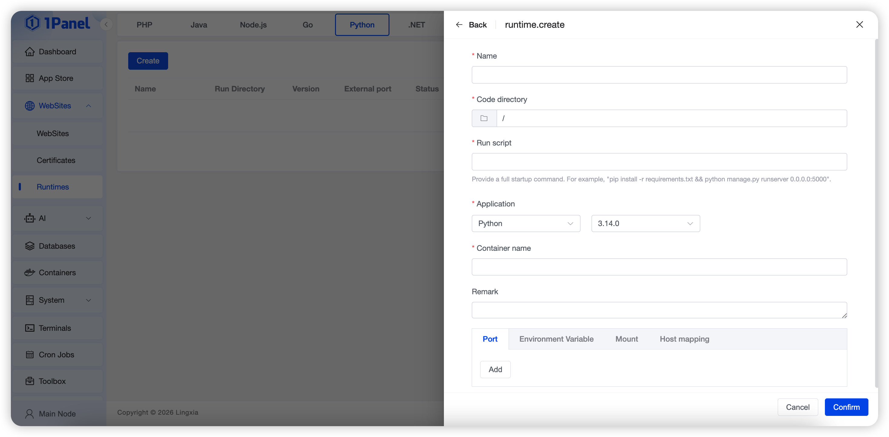

## 1 Create Python Runtime Environment

!!! note ""
    Click the **Create Runtime Environment** button and select the Python version, runtime directory, and other information.

    - Currently supported versions: Python 3.10, 3.11, 3.12, and 3.13. Choose the appropriate version based on your needs.

{: .original}

## 2 Manage Python Runtime Environment

!!! note ""
    - On the list page, you can perform the following operations on the Python runtime environment: stop, start, restart, edit, delete, and view logs.

