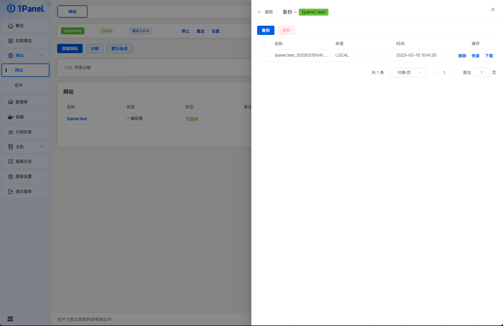
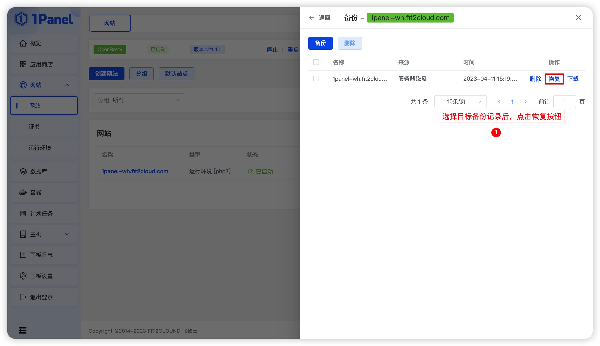
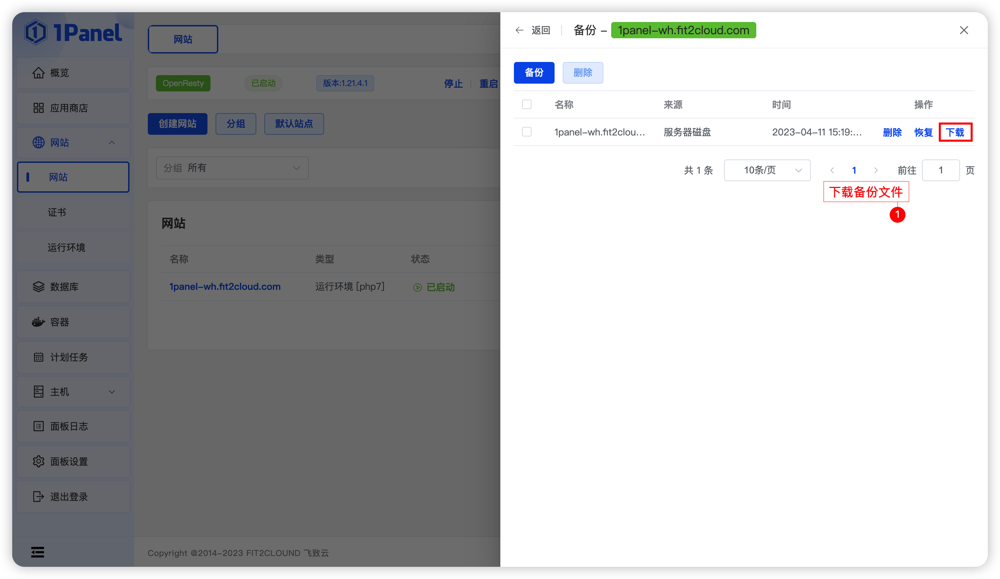
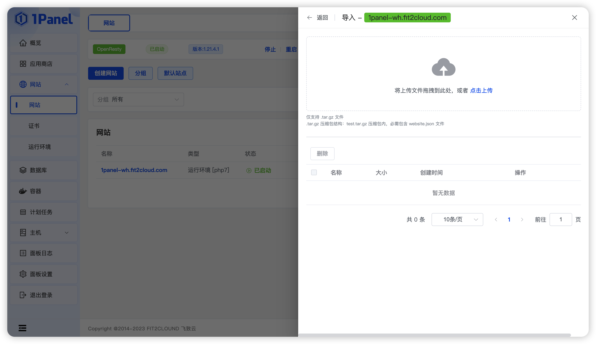

!!! Abstract ""

    功能包括: 备份/恢复网站、导入备份。

## 1 创建备份

!!! Abstract ""

    点击备份按钮，会在系统默认的备份目录下创建网站的备份文件。
    

    
## 2 网站恢复

!!! Abstract ""

    备份列表中选择目标备份记录，点击恢复按钮进行恢复操作。

## 3 备份下载

!!! Abstract ""

    下载网站备份记录。

## 4 导入备份

!!! Abstract ""

    选择网站的备份文件并上传，后续支持网站恢复等操作。

