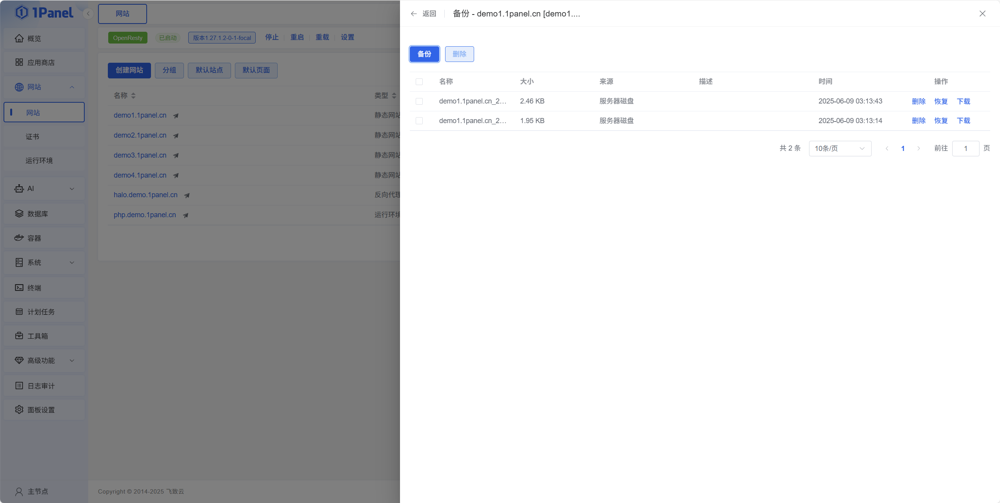
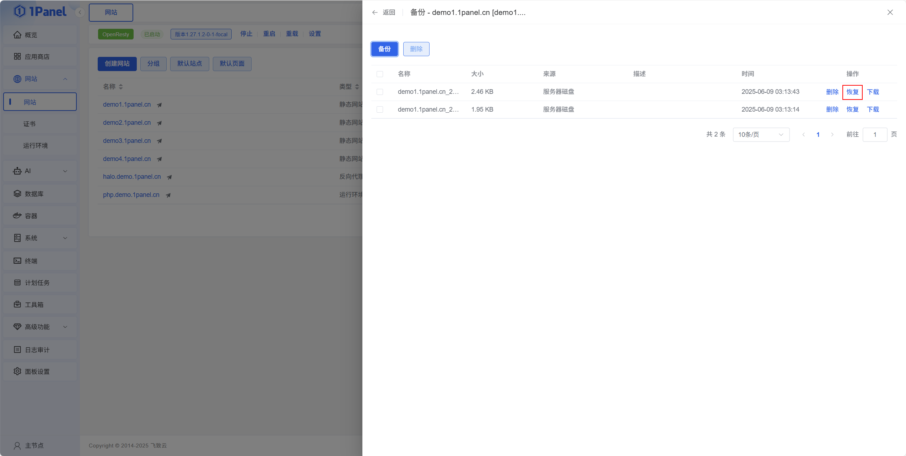
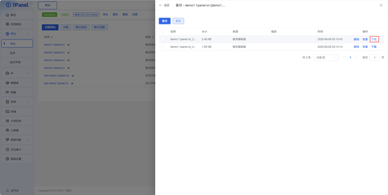
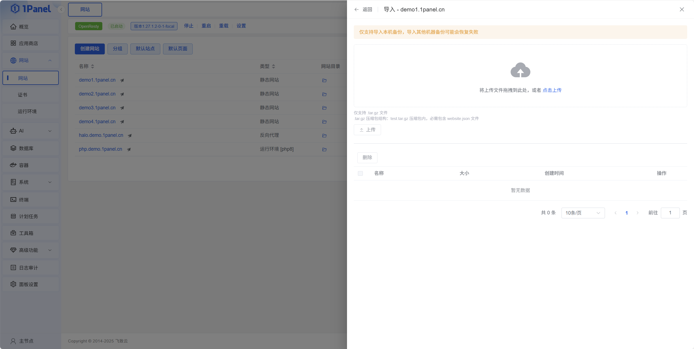

!!! note ""
    Supports backing up and restoring website data, as well as importing existing backups to ensure website content security and ease of management.

## 1 Create Backup

!!! note ""
    Click **Backup List** in the **More** menu of the website list. The system will generate a backup file in the default backup directory.

{: .browser-mockup}

## 2 Restore Website

!!! note ""
    Select the target backup record in the backup list and click **Restore** to perform the restoration.

{: .browser-mockup}

## 3 Download Backup

!!! note ""
    Supports downloading website backups to your local machine for later use in the upload backup page.

{: .browser-mockup}

## 4 Import Backup

!!! note ""
    Select and upload a website backup file.

{: .browser-mockup}
