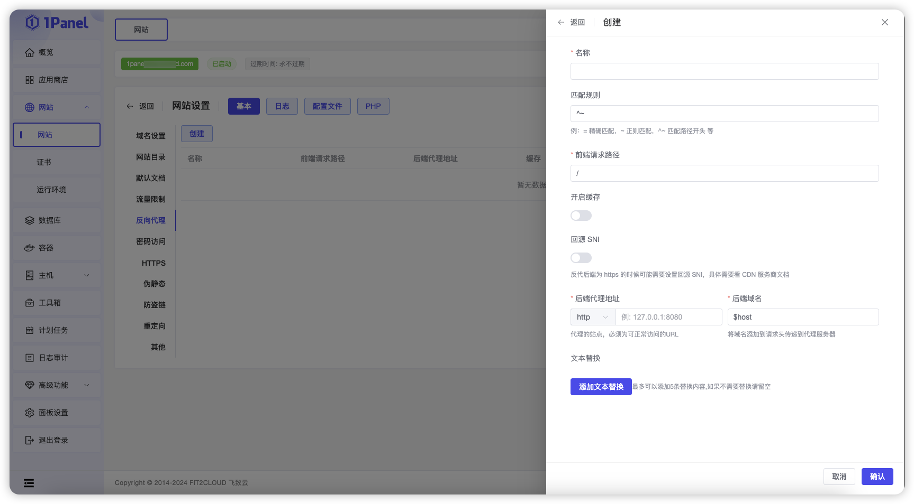
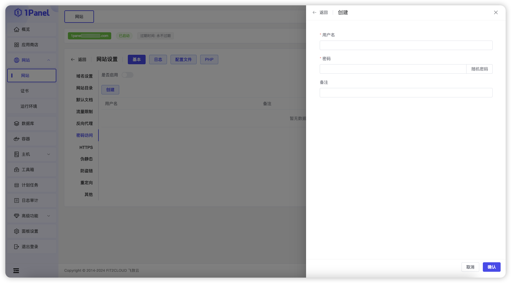
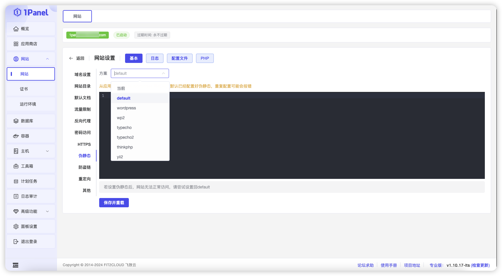
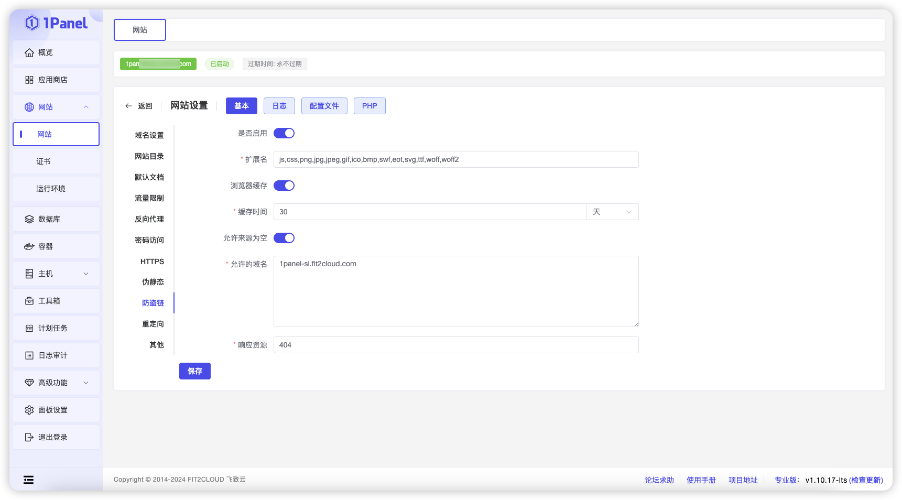
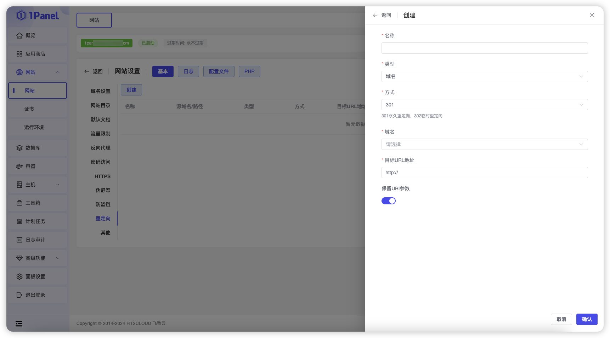
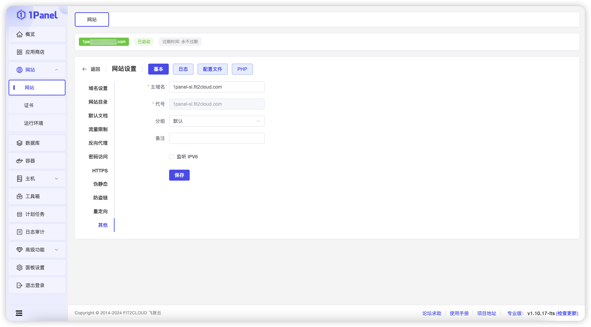

!!! Abstract ""

    网站设置页面包含多种功能，包括域名设置、网站目录、默认文档、流量限制、反向代理、密码保护、HTTPS 配置、伪静态、防盗链、重定向及其他设置。

## 1 域名设置

!!! Abstract ""

    域名设置页面允许用户管理网站的域名和端口配置。

## 2 网站目录

!!! Abstract ""

    网站目录页面支持查看网站的根目录，设置运行目录，以及配置运行用户和用户组等选项。

## 3 默认文档

!!! Abstract ""

    配置默认文档，以便在用户访问网站根目录时自动加载指定的文件。

## 4 流量限制

!!! Abstract ""

    允许用户配置流量限制，通过选择不同的限制方案，控制网站的带宽和访问流量。

## 5 反向代理

!!! Abstract ""

    反向代理功能允许将网站请求转发到后端服务器，以实现负载均衡、安全控制和内容分发。

## 6 密码访问

!!! Abstract ""

    密码访问功能允许用户为网站设置访问密码，以增强网站的安全性，限制未经授权的访问。

## 7 HTTPS

!!! Abstract ""

    配置网站的 HTTPS 功能时，用户需要填写或选择以下信息：

    - **HTTP 选项**：选择访问方式，包括：1. 自动将 HTTP 跳转到 HTTPS ；2. 允许直接访问 HTTP ；3. 禁止 HTTP 访问。
    - **HSTS**：开启 HSTS，以提升网站安全性。
    - **SSL 选项**：选择现有证书或导入新证书，现有证书需通过 1Panel 证书模块申请。
    - **Acme 账户**：选择已存在的 Acme 账户。
    - **证书**：选择已存在的证书。
    - **支持的协议版本**：选择 SSL 协议版本。
    - **加密算法**：指定 SSL 加密算法。

    通过以上配置，用户可以有效提升网站的安全性和访问性能。
    

## 8 伪静态

!!! Abstract ""

    伪静态功能通过将动态 URL 转换为更友好的静态 URL，提高网站的可读性和搜索引擎优化效果。

## 9 防盗链

!!! Abstract ""

    防盗链功能通过验证请求来源，阻止非授权用户直接链接和下载网站资源，以保护网站内容安全。

## 10 重定向

!!! Abstract ""

    重定向功能允许将访问特定URL的请求自动转发到另一个URL，以实现链接管理和流量引导。

## 11 其他

!!! Abstract ""

    支持更改主域名、切换分组以及更新备注信息等操作。

