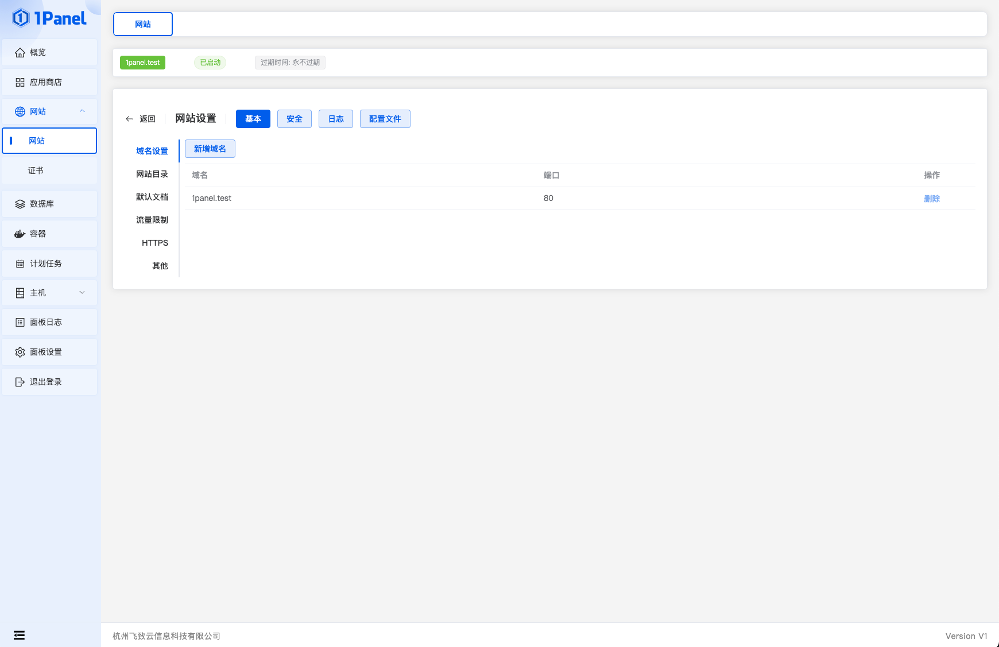
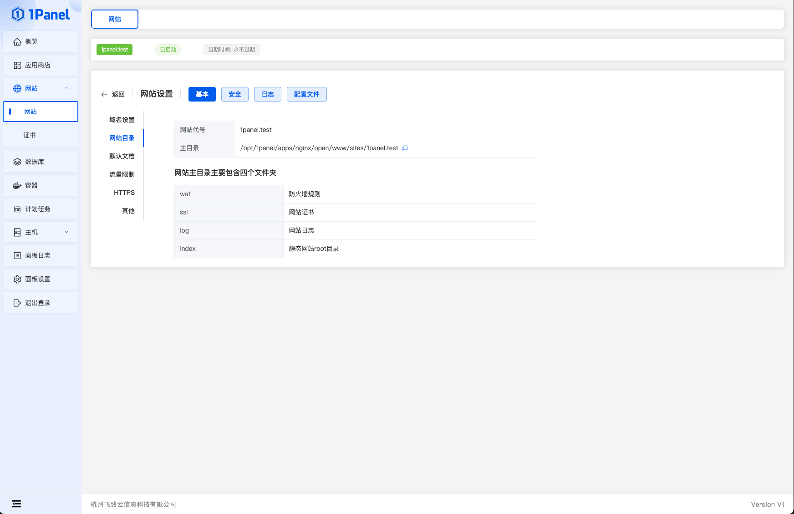
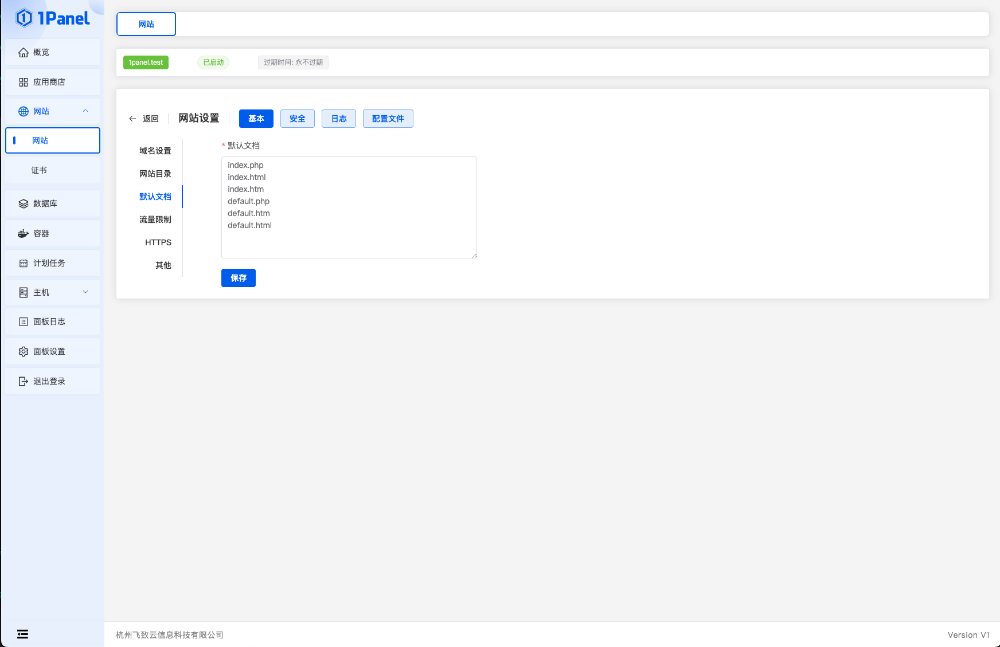
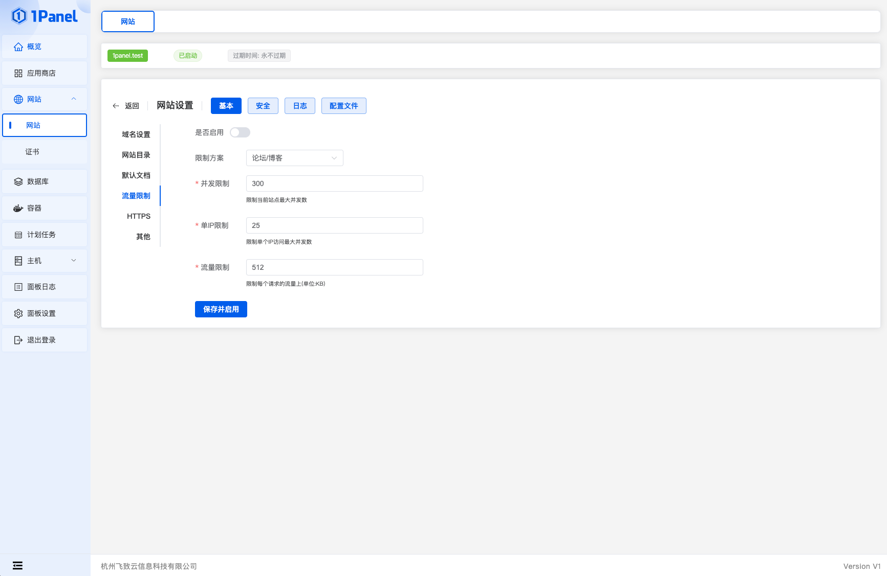
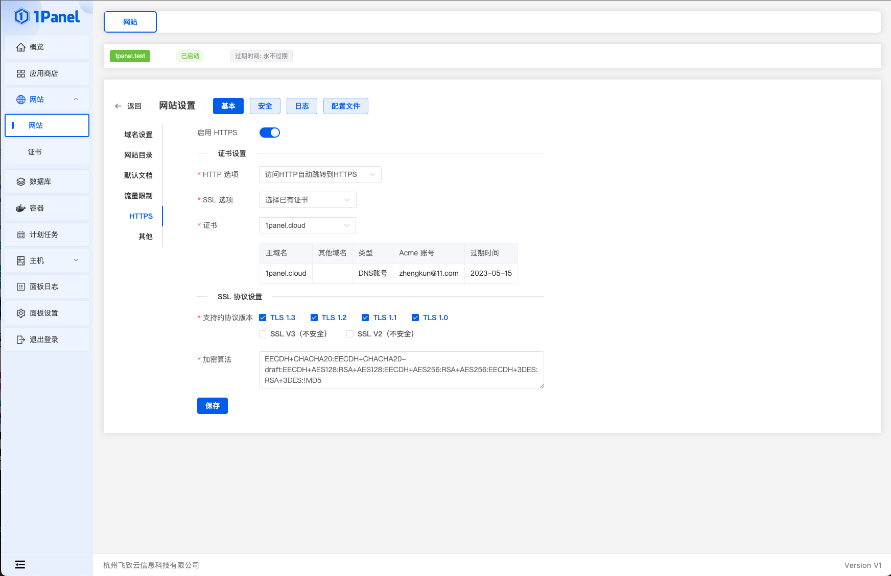

!!! Abstract ""

    基本配置包括域名设置、目录、文档、流量限制、HTTPS、其他等。

## 1 域名设置

!!! Abstract ""

    管理网站域名和端口。

## 2 网站目录

!!! Abstract ""

    查看网站目录。

## 3 默认文档

!!! Abstract ""

    修改站点创建默认生成的提示页面。

## 4 流量限制

!!! Abstract ""

    管理网站流量限制。

## 5 HTTPS

!!! Abstract ""

    配置网站的证书，填写或者选择以下信息：
    
    - HTTP 选项：有三种选项 1.访问 HTTP 自动跳转到 HTTPS 2.HTTP可直接访问 3. 禁止HTTP
    - SSL选项：选择已有证书或者导入证书，已有证书需要通过 1Panel 证书模块申请
    - 证书选择：选择已存在的证书
    - 支持的协议版本：选择 SSL 协议版本
    - 加密算法：SSL 加密算法
    

