!!! note ""

    网站设置页面包含多种功能，包括域名设置、网站目录、默认文档、流量限制、反向代理、负载均衡、密码访问、HTTPS 配置、真实 IP、伪静态、防盗链、重定向、关联数据库及其他设置。

## 1 域名设置

!!! note ""

    域名设置页面允许用户管理网站的域名和端口配置。

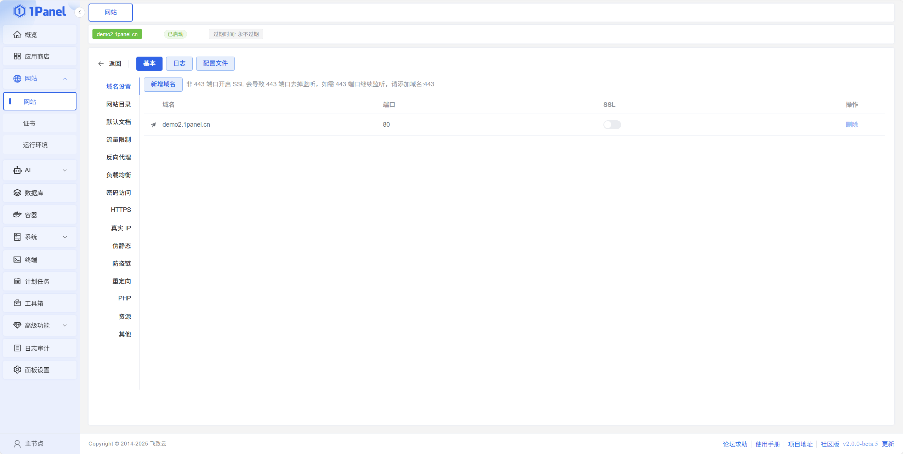
{: .browser-mockup}

## 2 网站目录

!!! note ""

    网站目录页面支持查看网站的根目录，设置运行目录，以及配置运行用户和用户组等选项。

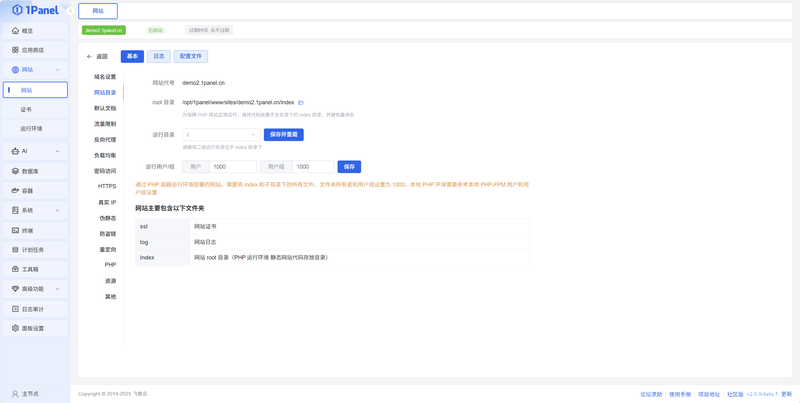
{: .browser-mockup}

## 3 默认文档

!!! note ""

    配置默认文档，以便在用户访问网站根目录时自动加载指定的文件。

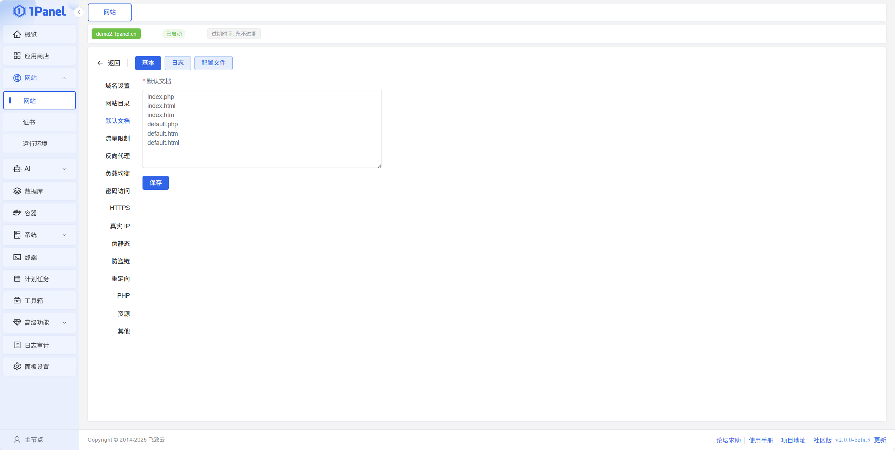
{: .browser-mockup}

## 4 流量限制

!!! note ""

    允许用户配置流量限制，通过选择不同的限制方案，控制网站的带宽和访问流量。

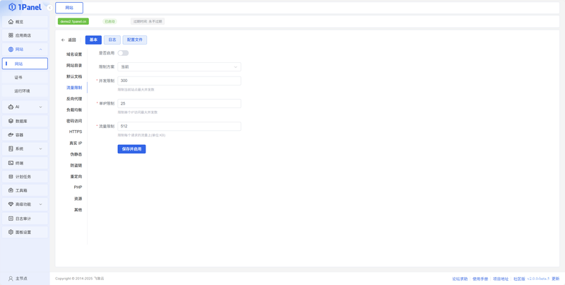
{: .browser-mockup}

## 5 反向代理

!!! note ""

    反向代理功能允许将网站请求转发到后端服务器，以实现负载均衡、安全控制和内容分发。

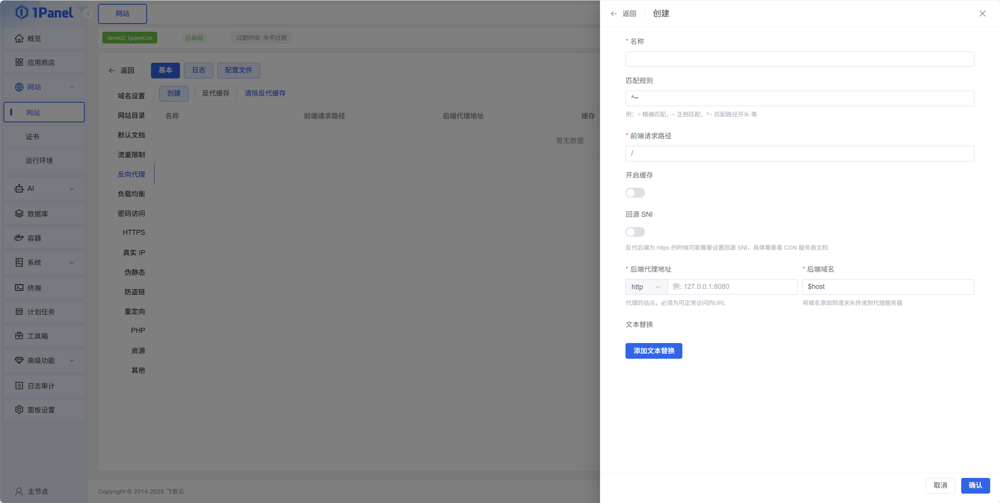
{: .browser-mockup}

!!! note ""

    用户也可以在当前页面开启并配置反向代理缓存规则，或者清除当前缓存。

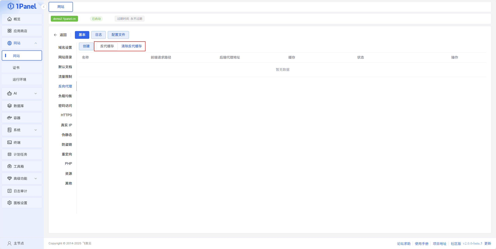
{: .browser-mockup}

## 6 负载均衡

!!! note ""

    创建负载均衡规则，用于将当前网站请求转发到多个后端服务。当前页面仅创建负载均衡规则，使用负载均衡规则需要在创建反向代理时使用 `http://<负载均衡名称>`。

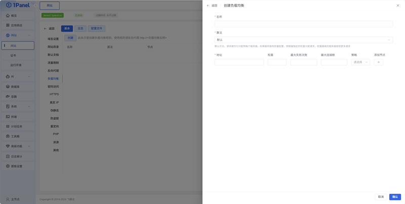
{: .browser-mockup}

## 7 密码访问

!!! note ""

    密码访问功能允许用户为网站设置访问密码，以增强网站的安全性，限制未经授权的访问。支持创建全局配置或按路径配置。

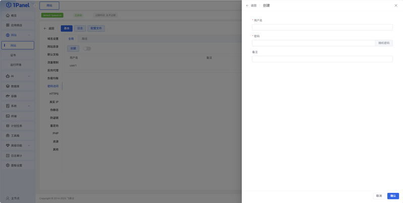
{: .browser-mockup}

## 8 HTTPS

!!! note ""

    配置网站的 HTTPS 功能时，用户需要填写或选择以下信息：

    - **HTTP 选项**：选择访问方式，包括：
        - 自动将 HTTP 跳转到 HTTPS 
        - 允许直接访问 HTTP 
        - 禁止 HTTP 访问
    - **HSTS**：开启 HSTS，以提升网站安全性
    - **HTTP3**：开启 HTTP3，HTTP/3 是 HTTP/2 的升级版本，提供更快的连接速度和更好的性能，但是不是所有浏览器都支持 HTTP/3，开启后可能会导致部分浏览器无法访问
    - **SSL 选项**：选择现有证书或手动导入证书，选择已有证书需通过 1Panel 证书模块申请
        - **Acme 账户（选择已有证书）**：选择已存在的 Acme 账户
        - **证书（选择已有证书）**：选择已存在的证书
        - **导入方式（手动导入证书）**：手动粘贴证书文件内容或者从服务器选择证书文件
        - **私钥（手动导入证书）**：私钥文件内容或文件位置
        - **证书（手动导入证书）**：证书文件内容或文件配置
    - **支持的协议版本**：选择 SSL 协议版本
    - **加密算法**：指定 SSL 加密算法

    通过以上配置，用户可以有效提升网站的安全性和访问性能。
    
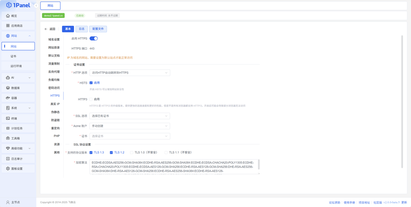
{: .browser-mockup}

## 9 真实 IP

!!! note ""
    配置客户端 IP 获取方式及可信的 IP 来源，OpenResty 会分析 HTTP Header 中的 IP 信息，准确识别并记录访客的真实 IP 地址，包括在访问日志中。

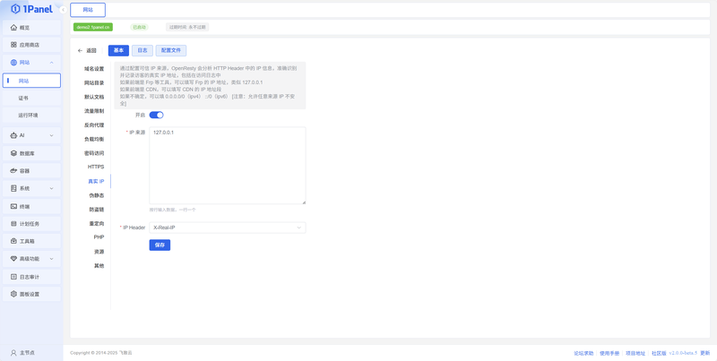
{: .browser-mockup}

## 10 伪静态

!!! note ""

    伪静态功能通过将动态 URL 转换为更友好的静态 URL，提高网站的可读性和搜索引擎优化效果。

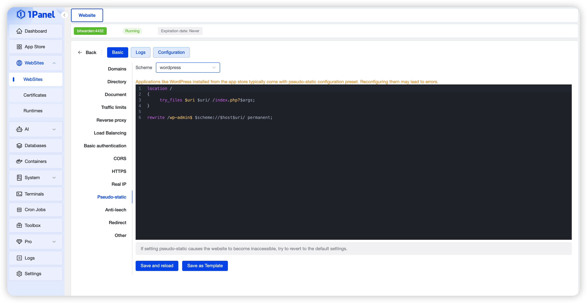
{: .browser-mockup}

## 11 防盗链

!!! note ""

    防盗链功能通过验证请求来源，阻止非授权用户直接链接和下载网站资源，以保护网站内容安全。

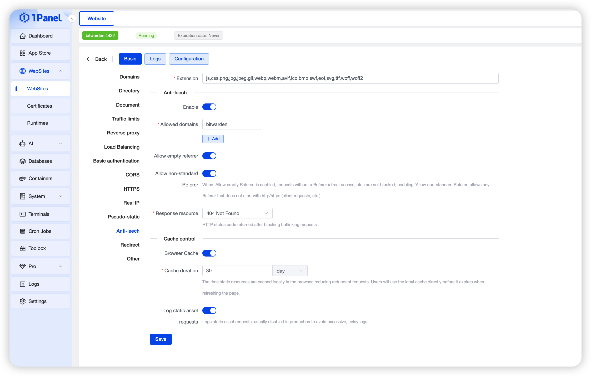
{: .browser-mockup}

## 12 重定向

!!! note ""

    重定向功能允许将访问特定URL的请求自动转发到另一个URL，以实现链接管理和流量引导。

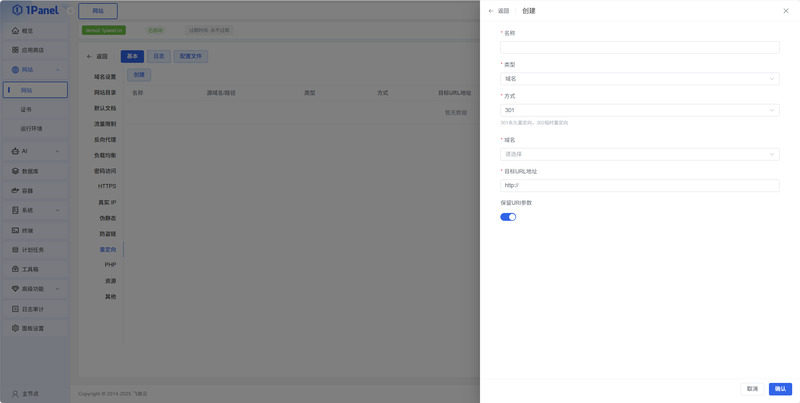
{: .browser-mockup}

## 13 PHP

!!! note ""

    静态页面类型的网站可以在此选择 PHP 运行环境切换为 PHP 类型网站，PHP 类型的网站可以切换不同的 PHP 运行环境。

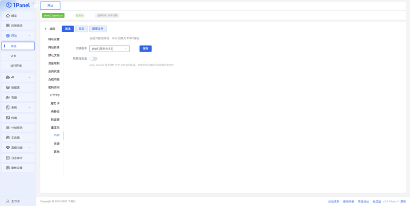
{: .browser-mockup}

## 14 资源

!!! note ""

    将当前网站与某一个数据库进行关联，备份网站时将同时备份关联的数据库。切换其他数据库会导致以前的备份无法恢复。

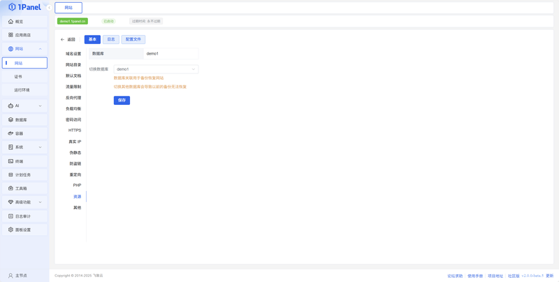
{: .browser-mockup}

## 15 其他

!!! note ""

    支持更改主域名、切换分组以及更新备注信息等操作。

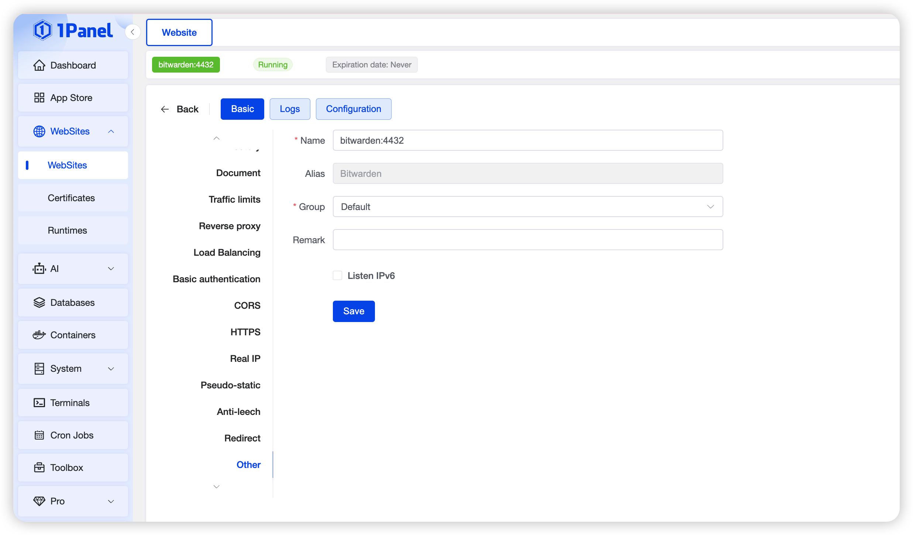
{: .browser-mockup}
