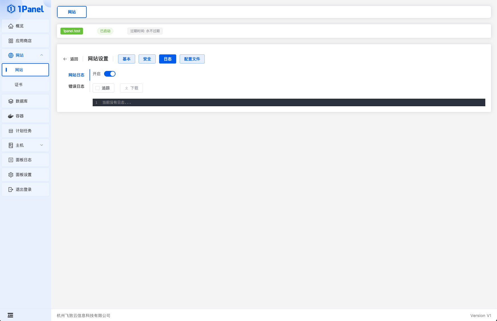
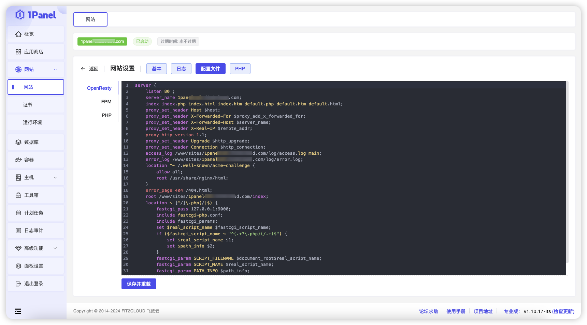
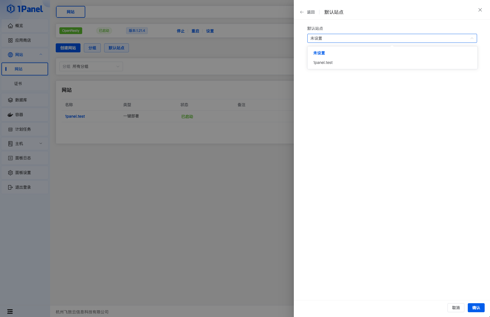
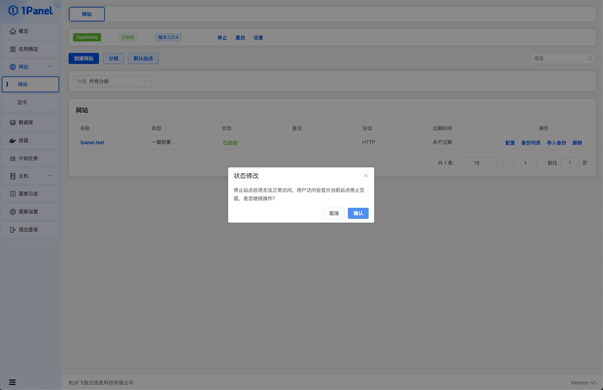
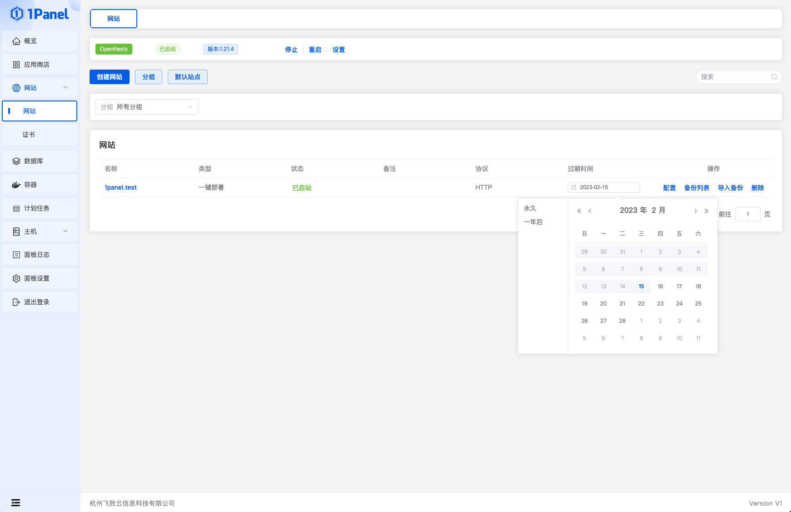
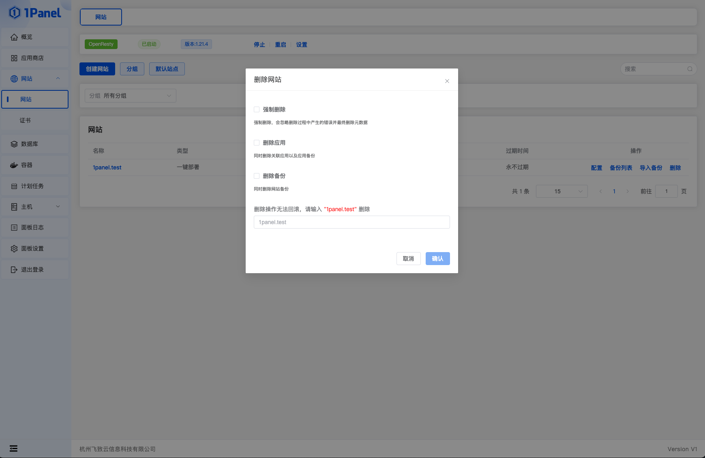

## 1 日志

!!! Abstract ""

    查看网站正常日志和错误日志，功能包括：

    - 开启/关闭日志
    - 追踪日志
    - 下载日志

## 2 配置文件

!!! Abstract ""

    设置网站的 openresty 配置文件。

## 3 默认站点

!!! Abstract ""

    设置所有网站的默认站点。

## 4 开启/停止网站

!!! Abstract ""

    开启/停止站点。

## 5 设置过期时间

!!! Abstract ""

    设置网站过期时间，到过期时间自动停止站点。

## 6 删除网站

!!! Abstract ""
    
    - 强制删除：无视删除过程中的错误，直接删除
    - 删除应用：使用 1Panel 应用部署的网站，删除时可以一并删除应用
    - 删除备份：删除网站同时删除备份

