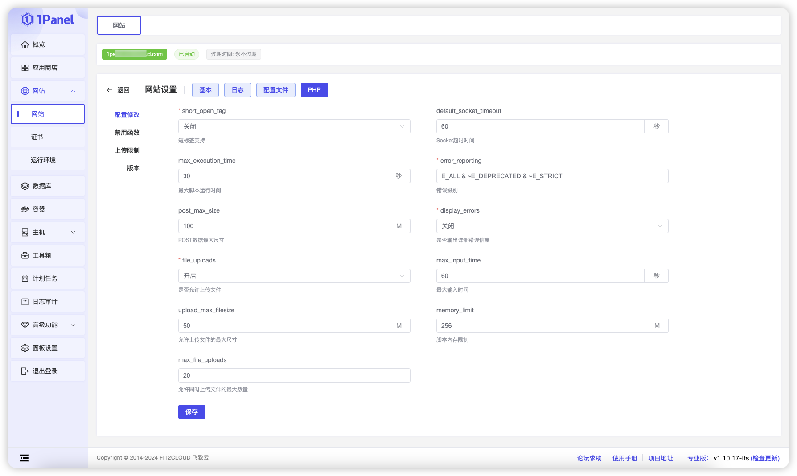

## 1 日志

!!! Abstract ""

    1Panel 的网站日志查看功能支持以下操作：

    - 查看正常日志和错误日志
    - 开启/关闭日志记录
    - 实时追踪日志内容
    - 下载日志文件
    - 清空日志内容

## 2 配置文件

!!! Abstract ""

    - 查看并修改目标网站的 OpenResty 配置文件设置。
    - PHP 运行环境网站还支持修改 FPM 和 PHP 配置文件。

## 3 PHP

!!! Abstract ""

    PHP 运行环境网站支持配置修改，包括禁用函数、调整上传限制以及切换 PHP 版本等功能。

## 4 默认站点

!!! Abstract ""

    设置默认站点功能允许用户在未匹配到任何域名时，将请求自动定向到指定的默认网站。

## 5 开启 / 停止网站

!!! Abstract ""

    点击列表中的【已启动】或【已停止】按钮，可以切换网站的运行状态。

## 6 设置过期时间

!!! Abstract ""

    设置网站过期时间后，系统将在到期时自动停止该站点，以确保资源的有效管理和使用。

## 7 删除网站

!!! Abstract ""
    
    - **强制删除**：跳过删除过程中的错误，直接执行删除操作。
    - **删除应用**：可在删除网站时一并删除与之相关的 1Panel 应用。
    - **删除备份**：在删除网站的同时，也会删除其备份。

