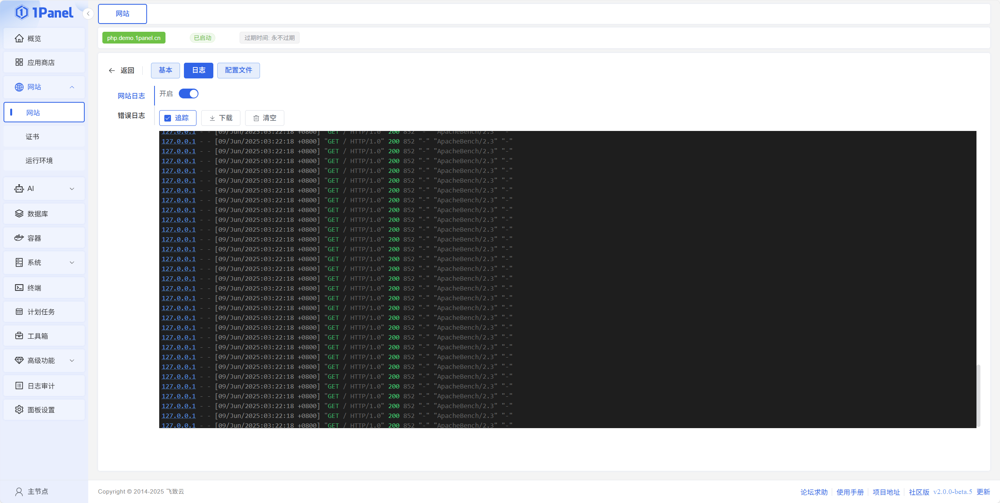
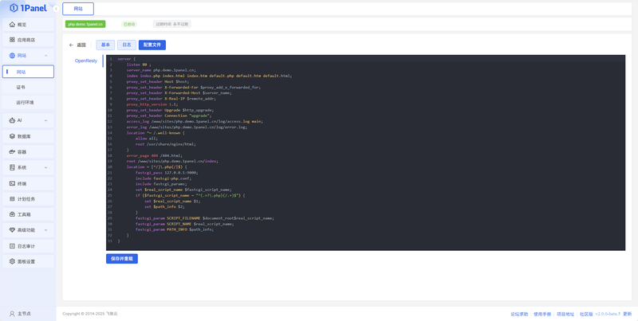
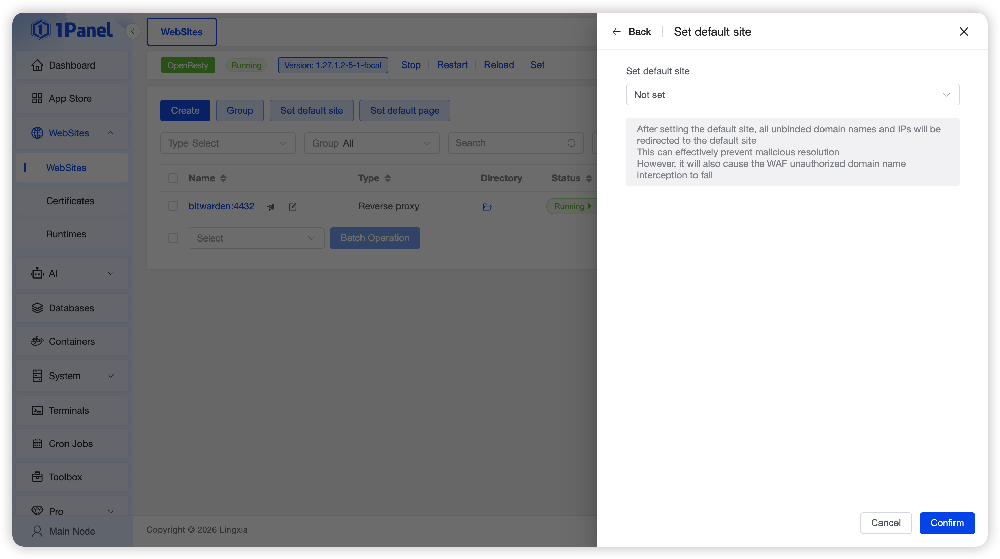
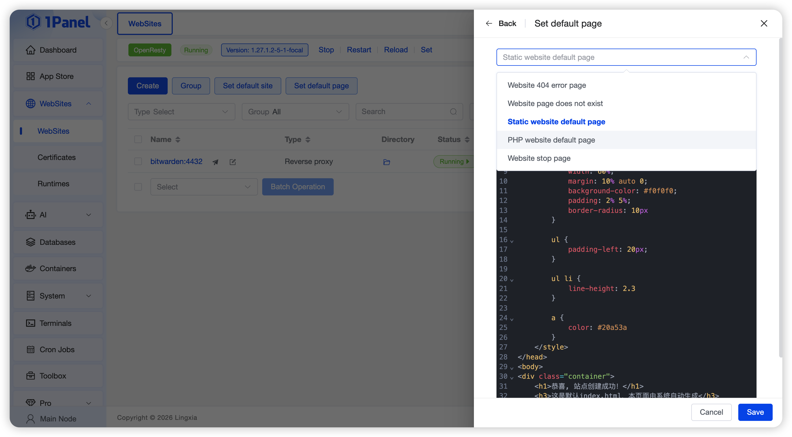
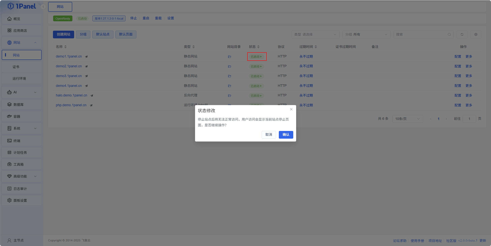
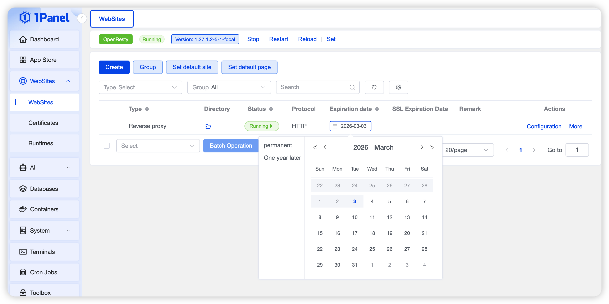
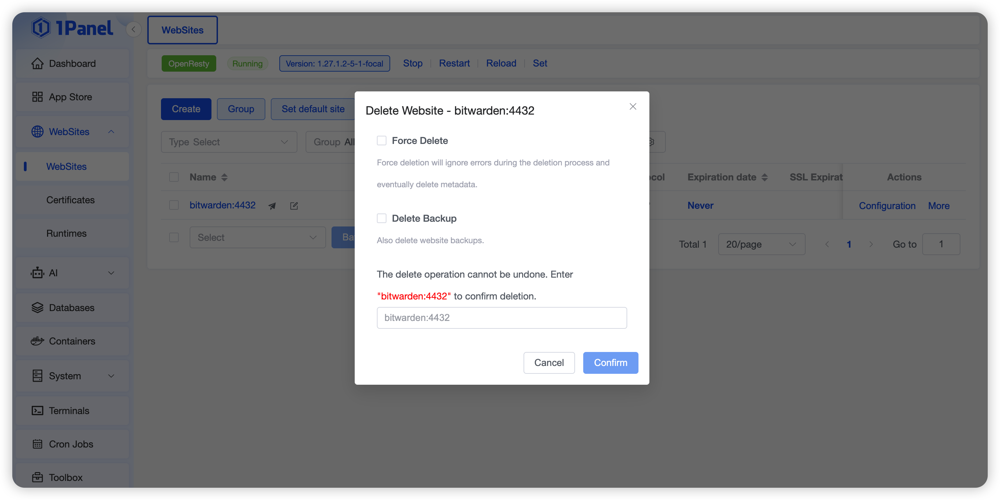

# 网站操作

本页说明网站配置中的日志与资源，以及网站列表中的全局和单站点操作。社区版、专业版和企业版均可使用；用户需要对应的网站管理权限。

## 1 日志

!!! note ""

    1Panel 的网站日志查看功能支持以下操作：

    - 查看正常日志和错误日志
    - 开启/关闭日志记录
    - 实时追踪日志内容
    - 下载日志文件
    - 清空日志内容

## 2 资源与配置文件

!!! note ""

    - **资源** 标签当前用于查看和修改目标网站的 OpenResty 配置文件。
    - PHP 运行环境网站的 PHP 和 FPM 配置入口以当前运行环境页面为准。
    - 保存配置前应检查语法；错误配置可能导致当前网站或 OpenResty 重载失败。

## 3 默认站点

!!! note ""

    在网站列表点击 **高级设置**，可设置未匹配到其他域名时使用的默认网站。

## 4 默认页面

!!! note ""

    在 **高级设置** 中还可修改以下默认页面，并选择是否同步到已有网站。
    
    - **网站 404 错误页**
    - **网站不存在页**
    - **静态页面默认页**
    - **PHP 网站默认页**
    - **网站停用页**

## 5 开启 / 停止网站

!!! note ""

    点击列表中的 **已启动** 或 **已停止** 可以切换 HTTP 网站状态。TCP/UDP 代理不通过该状态按钮切换。

## 6 设置过期时间

!!! note ""

    设置网站过期时间后，系统将在到期时自动停止该站点，以确保资源的有效管理和使用。

## 7 删除网站

!!! note ""
    
    在网站列表更多操作中，可以删除指定网站。

    - **强制删除**：跳过删除过程中的错误，直接执行删除操作
    - **删除应用**：可在删除网站时一并删除与之相关的 1Panel 应用
    - **删除备份**：在删除网站的同时，也会删除其备份

!!! danger "删除网站"
    强制删除、删除关联应用或删除备份都可能造成不可逆的数据丢失。操作前应确认网站目录、关联数据库、应用数据和备份保留策略。

