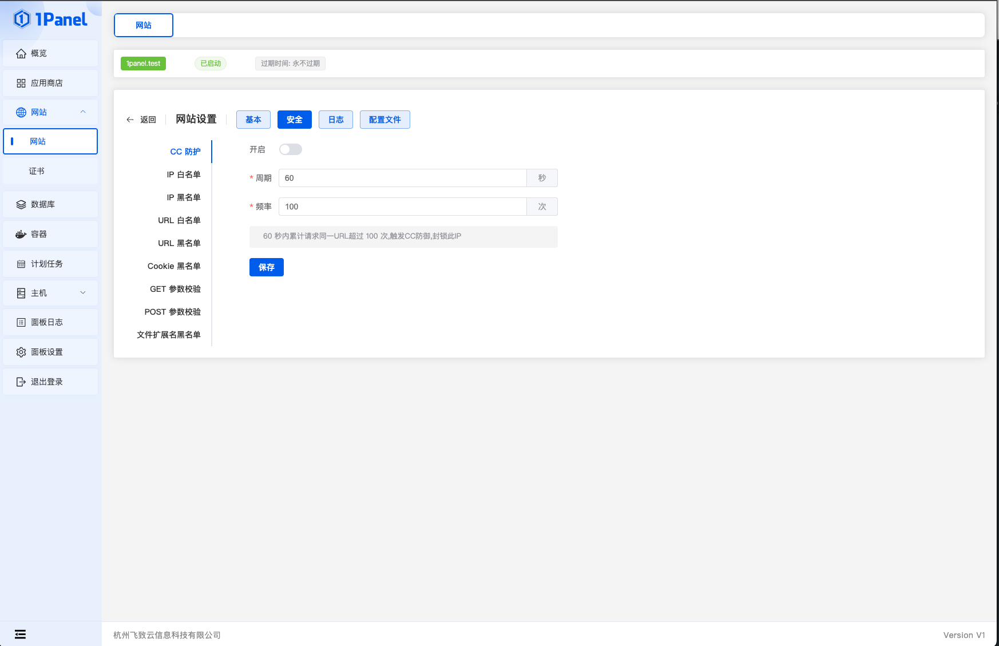
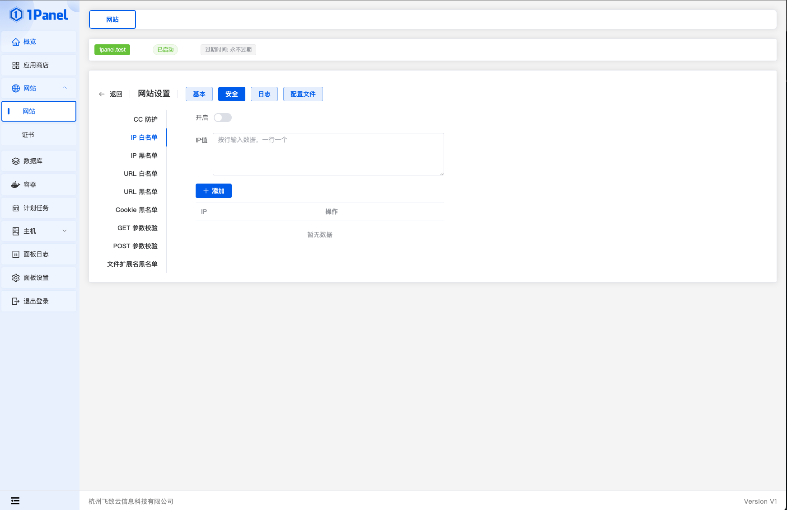
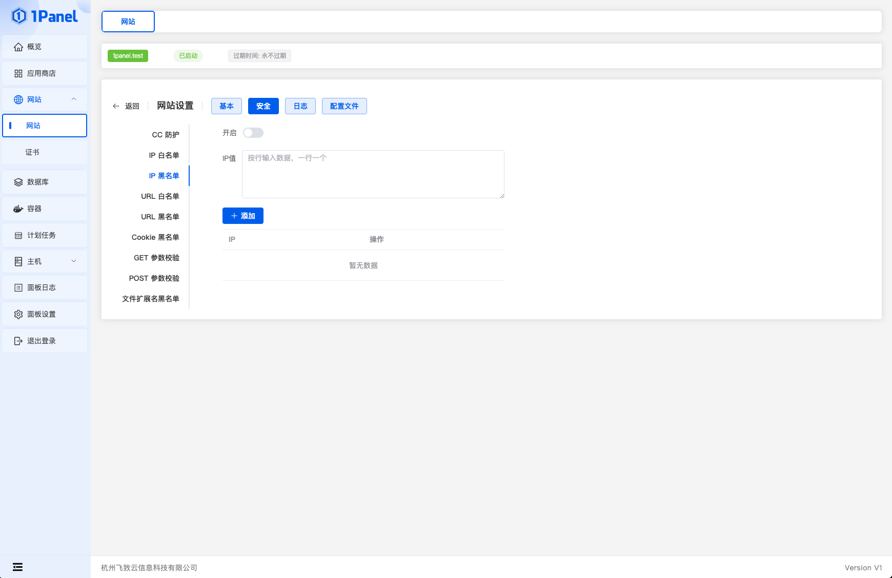
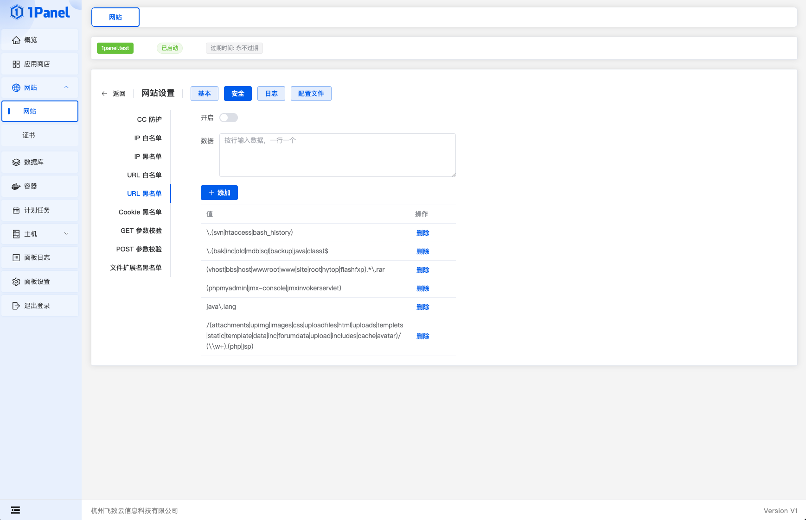
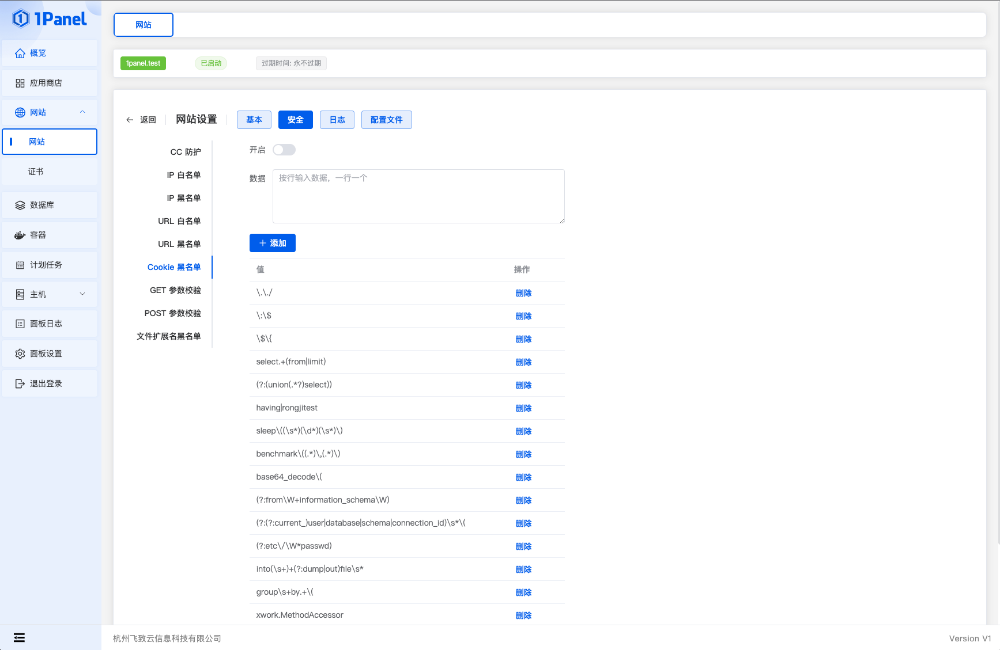
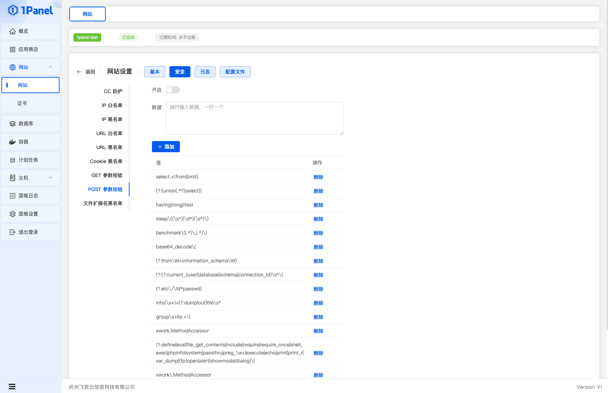
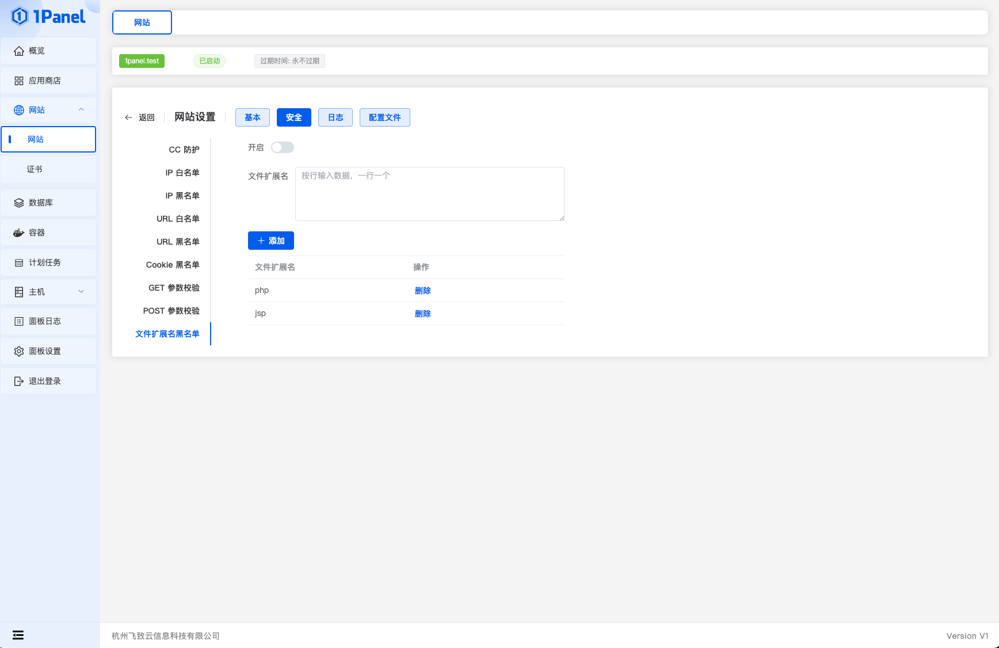

!!! note ""
    Configure WAF for the website.

## 1 CC Protection

!!! note ""
    Configure CC Protection by filling in the following information:

    - Period: Detection period for CC Protection
    - Frequency: Frequency threshold for CC Protection

    Example: Period 60, Frequency 100 means if the same URL receives more than 100 requests within 60 seconds, CC Protection is triggered and the IP is blocked.

## 2 IP Whitelist

!!! note ""
    Set an IP whitelist for website access.

## 3 IP Blacklist

!!! note ""
    Set an IP blacklist to block website access.

## 4 URL Whitelist

!!! note ""
    Set a URL whitelist for website access.

## 5 URL Blacklist

!!! note ""
    Set a URL blacklist to block website access.

## 6 Cookie Blacklist

!!! note ""
    Set a blacklist for forbidden data in cookies.

## 7 GET Parameter Validation

!!! note ""
    Set forbidden parameters in GET requests.

## 8 POST Parameter Validation

!!! note ""
    Set forbidden parameters in POST requests.

## 9 File Extension Blacklist

!!! note ""
    File types that are forbidden from being uploaded.

