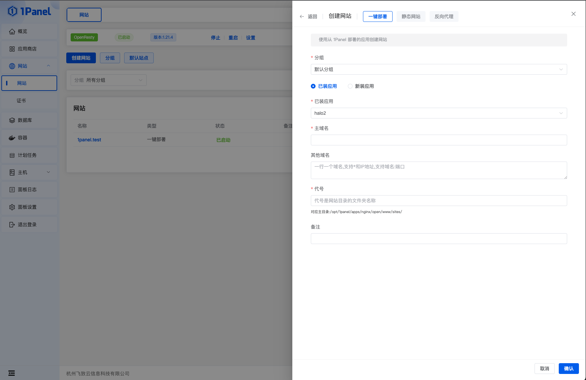
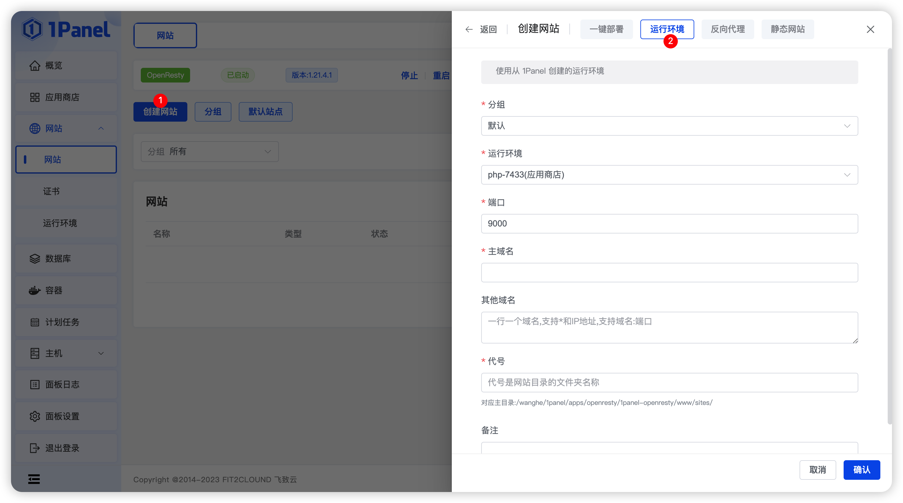
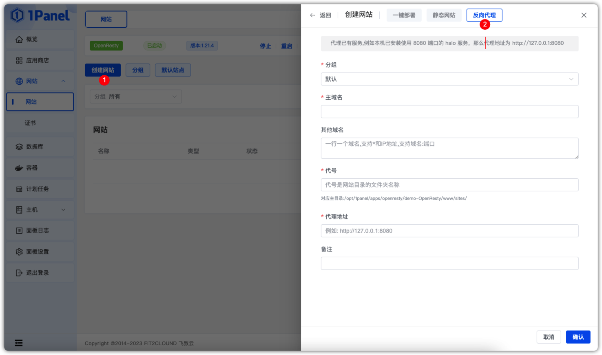

!!! Abstract ""
    **支持一键部署、运行环境（PHP）、反向代理、静态网站等方式创建网站。**

## 1 一键部署

!!! Abstract ""
    **可以使用应用商店中创建的应用来部署网站，例如 Wordpress、Halo。**

    - 分组：选择网站分组
    - 应用类型：选择已装应用还是新装应用。
    - 应用参数：如果选择新装应用，需要填写应用的相关参数。
    - 主域名：填写需要绑定的主要域名以及端口。
    - 其他域名：填写需要绑定的其他域名以及端口。
    - 代号：代号是网站目录的文件夹名称。
    - 备注：描述该站点的作用。

## 2 运行环境

!!! Abstract ""
    **可以使用已添加的运行环境来创建网站。**

    - 分组：选择网站分组
    - 运行环境：运行环境菜单中已创建的运行环境（当前版本只支持PHP）。
    - 端口：网站的服务端口。
    - 主域名：填写需要绑定的主要域名以及端口。
    - 其他域名：填写需要绑定的其他域名以及端口。
    - 代号：代号是网站目录的文件夹名称。
    - 备注：描述该站点的作用。

## 3 反向代理

!!! Abstract ""
    **创建代理已有服务的网站。**

    - 分组：选择网站分组。
    - 主域名：填写需要绑定的主要域名以及端口。
    - 其他域名：填写需要绑定的其他域名以及端口。
    - 代号：代号是网站目录的文件夹名称。
    - 代理地址：已有服务的服务地址。
    - 备注：描述该站点的作用。

## 4 静态网站

!!! Abstract ""
    **创建基于静态 Html 的网站。**

    - 分组：选择网站分组。
    - 主域名：填写需要绑定的主要域名以及端口。
    - 其他域名：填写需要绑定的其他域名以及端口。
    - 代号：代号是网站目录的文件夹名称。
    - 备注：描述该站点的作用。

