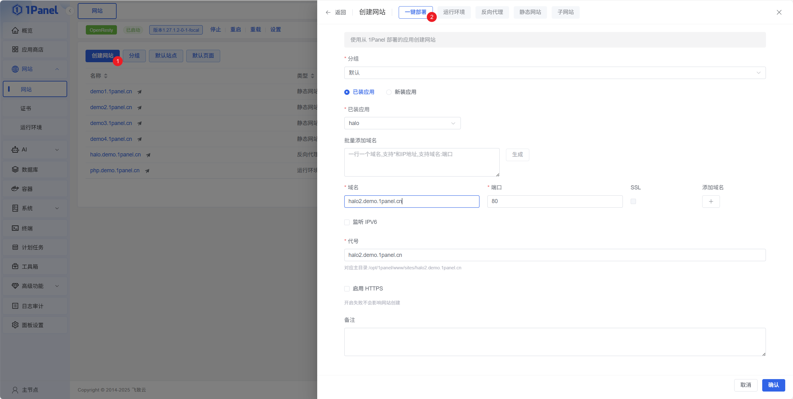
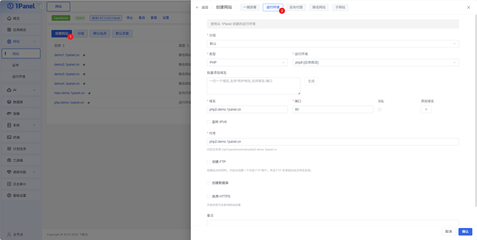
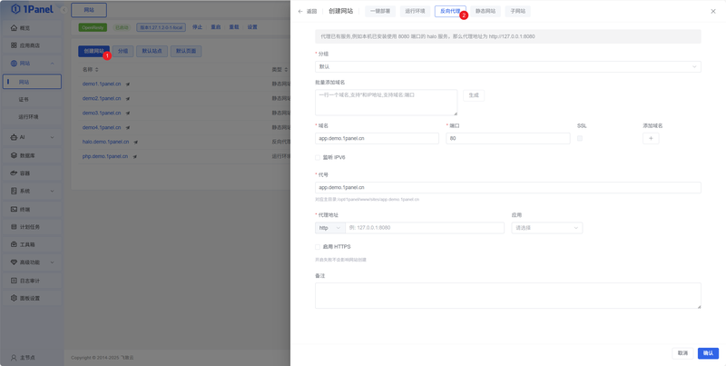
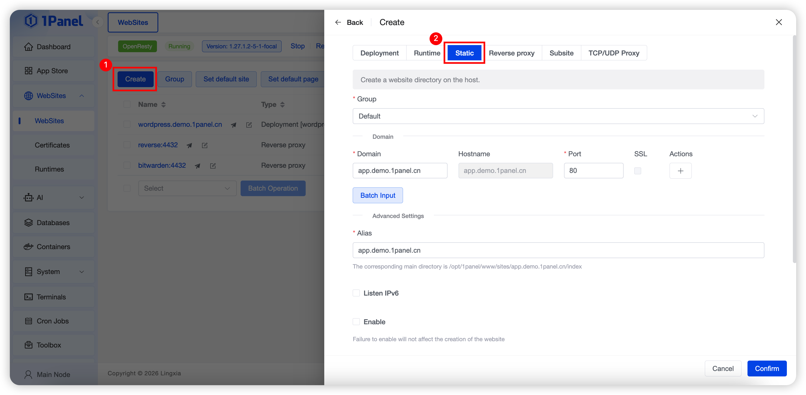
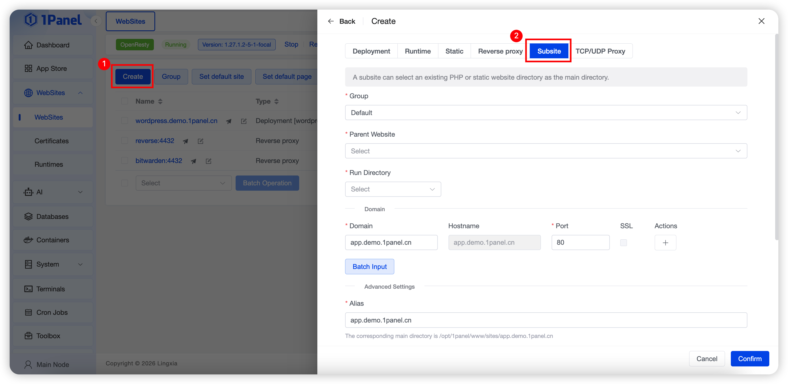

!!! note ""

    支持一键部署多种网站创建方式，包括运行环境（PHP、Java、Node.js、Go、Python）、反向代理和静态网站等，满足不同类型网站的快速搭建需求。

## 1 一键部署

!!! note ""

    可以通过应用商店中提供的应用，如 WordPress 和 Halo，轻松部署网站。

    - **分组**：选择网站所属的分组；
    - **应用类型**：选择已安装的应用或新安装的应用；
    - **应用参数**：如果选择新安装应用，请填写相关参数；
    - **主域名**：输入需要绑定的主要域名及其端口；
    - **其他域名**：输入需要绑定的其他域名及其端口；
    - **监听 IPv6**：使服务器能够通过 IPv6 地址接收客户端请求；
    - **代号**：设定网站目录的文件夹名称；
    - **启用 HTTPS**：开启 HTTPS 并选择 SSL 证书；
    - **备注**：填写对该站点作用的描述；

{: .browser-mockup}

## 2 运行环境

!!! note ""

    可以利用已添加的运行环境来创建网站。

    - **分组**：选择网站所属的分组；
    - **类型**：选择运行环境类型及某个已创建的运行环境（目前支持 PHP、Java、Node.js、Go、Python、.NET）；
    - **端口**：指定网站服务的端口；
    - **主域名**：填写需要绑定的主要域名及其端口；
    - **其他域名**：填写需要绑定的其他域名及其端口；
    - **监听 IPv6**：使服务器能够通过 IPv6 地址接收客户端请求；
    - **代号**：为网站目录指定一个代号，作为文件夹名称；
    - **创建 FTP**：创建站点的同时，为站点创建一个对应 FTP 帐户，并且 FTP 目录指向站点所在目录；
    - **创建数据库**：创建站点的同时，为站点创建一个数据库；
    - **启用 HTTPS**：开启 HTTPS 并选择 SSL 证书；
    - **备注**：提供该站点的功能描述。

{: .browser-mockup}

## 3 反向代理

!!! note ""

    支持创建反向代理网站，允许用户将请求转发到其他服务。

    - **分组**：选择网站所属的分组；
    - **主域名**：填写要绑定的主要域名及其端口；
    - **其他域名**：填写需要绑定的其他域名及其端口；
    - **监听 IPv6**：使服务器能够通过 IPv6 地址接收客户端请求；
    - **代号**：设定网站目录的文件夹名称；
    - **代理地址**：输入已有服务的地址，也可以从已安装应用中进行选择；
    - **启用 HTTPS**：开启 HTTPS 并选择 SSL 证书；
    - **备注**：描述该站点的功能或用途。

{: .browser-mockup}

## 4 静态网站

!!! note ""

    支持快速创建静态网站，提供便捷的部署和管理功能，让用户轻松发布和维护静态内容。
    
    - **分组**：选择网站所属的分组；
    - **主域名**：填写需要绑定的主要域名及其端口；
    - **其他域名**：填写需要绑定的其他域名及其端口；
    - **监听 IPv6**：使服务器能够通过 IPv6 地址接收客户端请求；
    - **代号**：设置代号，作为网站目录的文件夹名称；
    - **创建 FTP**：创建站点的同时，为站点创建一个对应 FTP 帐户，并且 FTP 目录指向站点所在目录；
    - **启用 HTTPS**：开启 HTTPS 并选择 SSL 证书；
    - **备注**：简要描述该站点的功能或用途。

{: .browser-mockup}

## 5 子网站

!!! note ""

    为已有的 PHP 或静态页面类型网站创建子网站，子网站可以选择已存在的 PHP 和静态网站的目录作为主目录。
    
    - **分组**：选择网站所属的分组；
    - **父级网站**：当前子网站的父级网站；
    - **运行目录**：选择父级网站运行目录下的子目录作为当前网站运行目录；
    - **主域名**：填写需要绑定的主要域名及其端口；
    - **其他域名**：填写需要绑定的其他域名及其端口；
    - **监听 IPv6**：使服务器能够通过 IPv6 地址接收客户端请求；
    - **代号**：设置代号，作为网站目录的文件夹名称；
    - **启用 HTTPS**：开启 HTTPS 并选择 SSL 证书；
    - **备注**：简要描述该站点的功能或用途。

{: .browser-mockup}