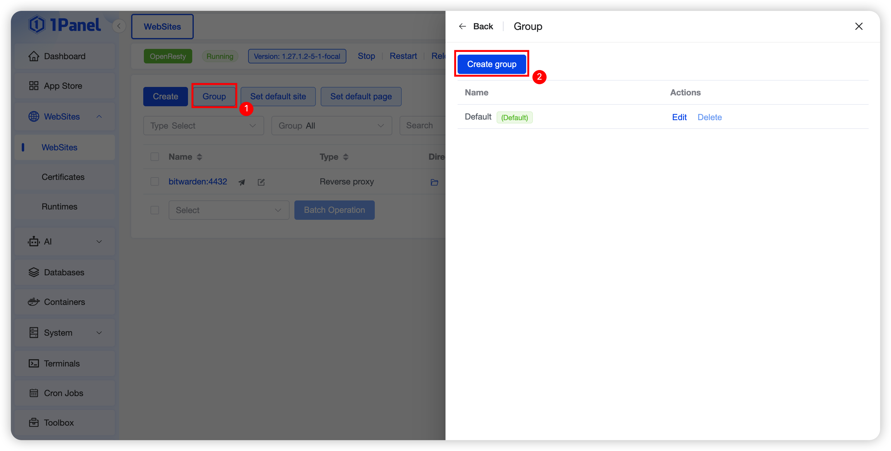
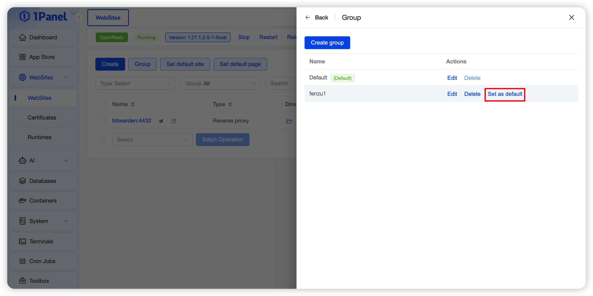
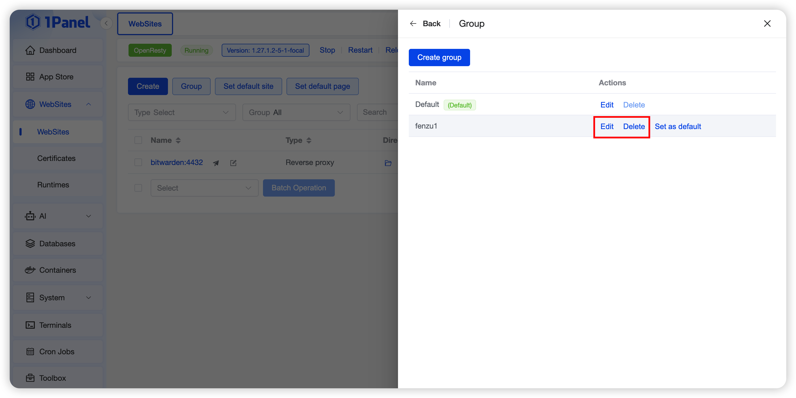

!!! note ""
    Supports grouping websites for better organization and management of multiple sites.

## 1 Create Group

{: .browser-mockup}

## 2 Default Group

!!! note ""
    After setting a default website group, new websites will be automatically assigned to this group.

{: .browser-mockup}

## 3 Modify / Delete Group

{: .browser-mockup}
