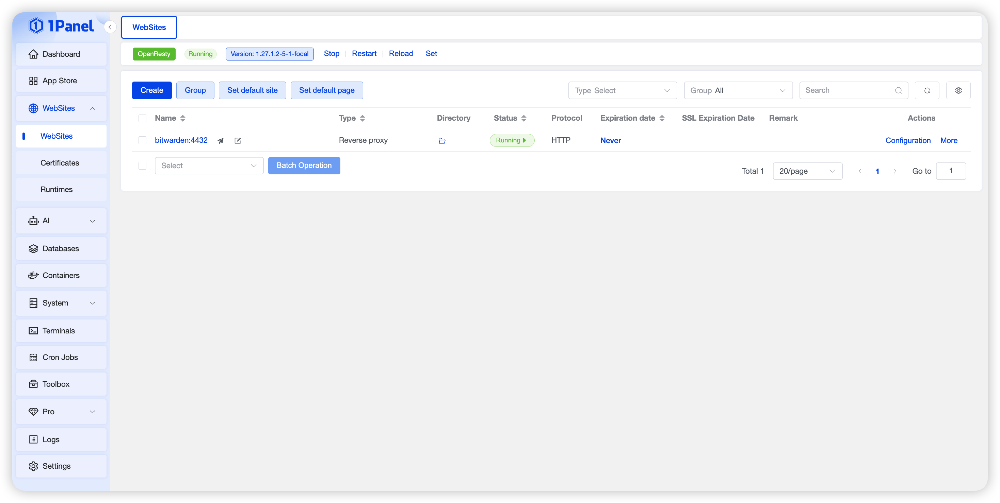

!!! note ""
    - The website management feature in 1Panel is designed to provide users with a convenient and efficient experience for creating and managing websites.
    - With 1Panel, users can easily build various types of websites, including static websites, reverse proxy sites, and websites supporting runtime environments such as PHP, Java, Node.js, Go, and Python.
    - The panel offers comprehensive management options, including domain binding, SSL certificate configuration, HTTPS enabling, pseudo‑static settings, redirection, anti‑leech protection, and more.
    - In addition, users can implement automatic backup and restoration of website data through 1Panel to ensure data security. With these features, 1Panel helps users easily manage all kinds of websites on their servers.

{: .browser-mockup}
