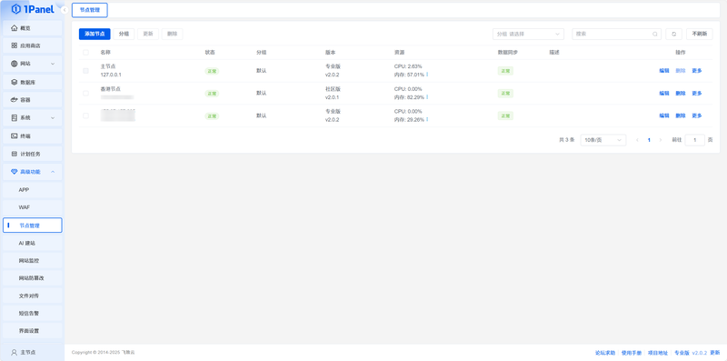
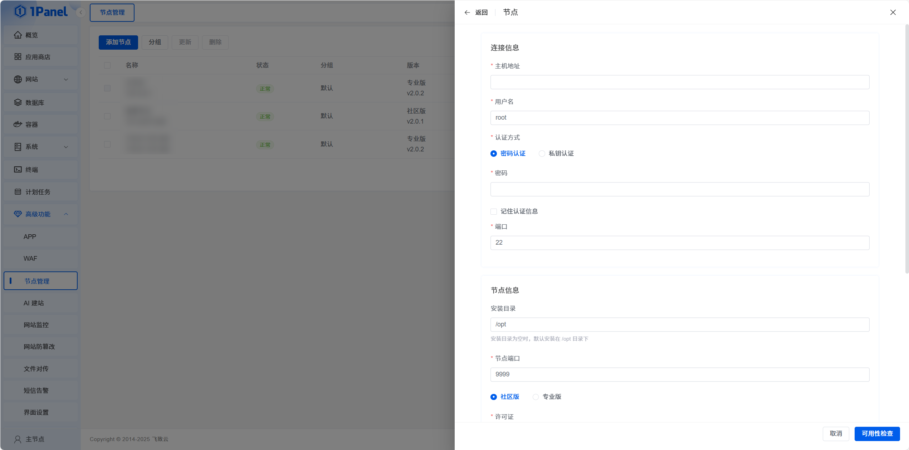
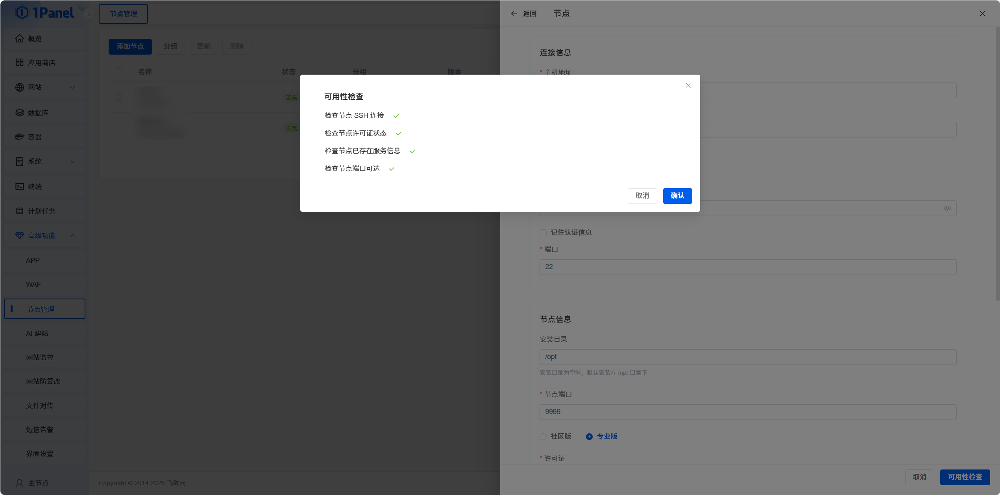
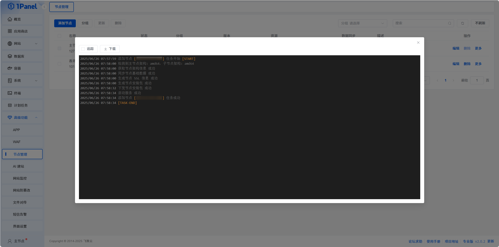
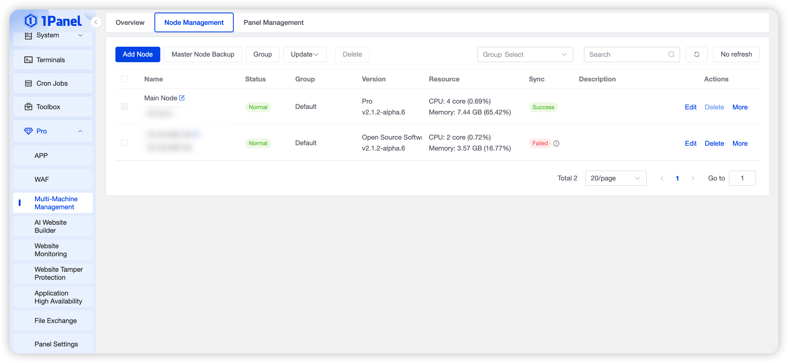
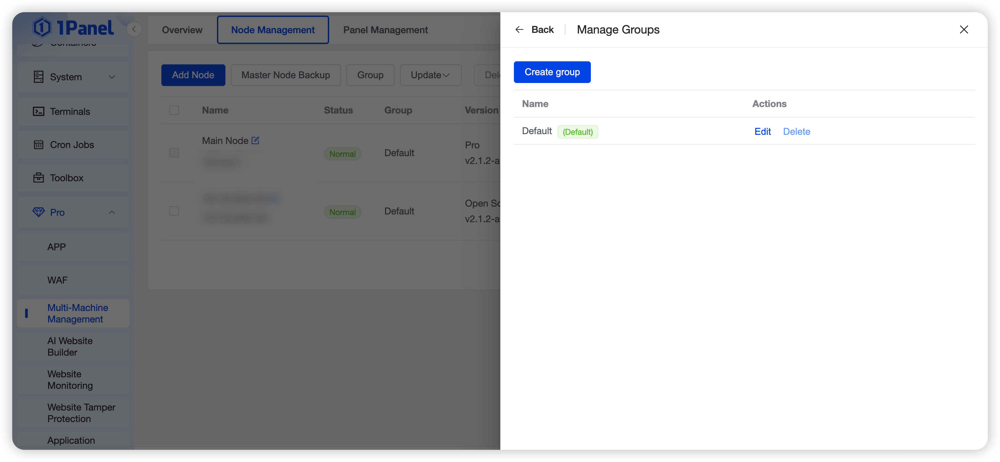
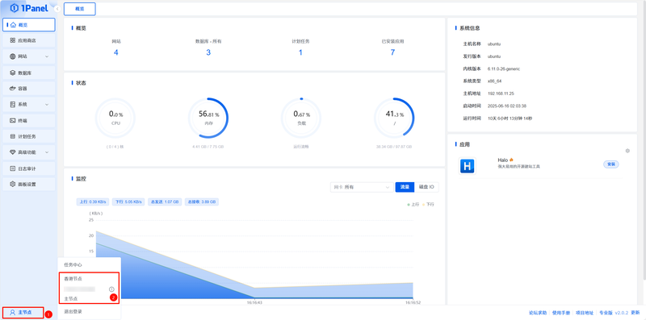
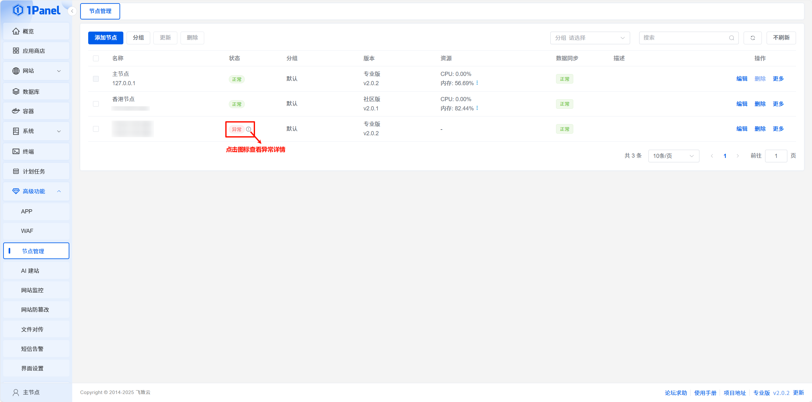
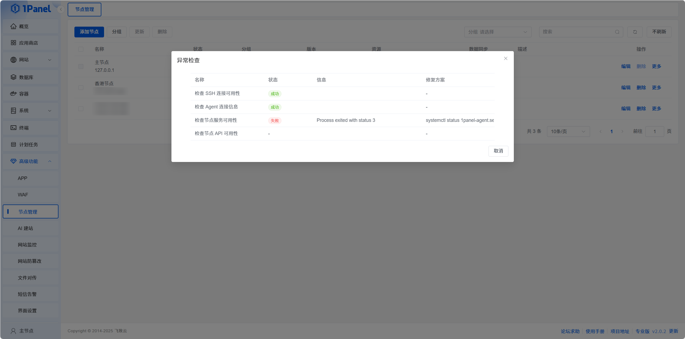

!!! note ""
    1Panel Node Management is designed to provide users with a convenient and efficient multi‑server management experience. With Node Management, you can easily manage multiple server nodes, enabling unified resource monitoring, application deployment, configuration management, and operations.

    💎 **Pro Edition Feature**: Node Management is exclusive to 1Panel Pro Edition, supporting advanced features such as multi‑node switching, unified monitoring, batch updates, and file transfer between nodes.

## 1 Feature Overview

!!! note "Feature Overview"
    - Node Management supports unified management of multiple server nodes, including node addition, deletion, status monitoring, and resource statistics.
    - Supports node grouping for classification by business, environment, or region.
    - Real‑time viewing of resource usage including CPU, memory, disk, and network for each node.
    - Supports multi‑node switching; you can switch between nodes in the unified console for application deployment and management.
    - Provides configuration synchronization between nodes to ensure consistent cluster configurations.

## 2 Node Overview

!!! note ""
    On the Node Overview page, you can view the overall status of all nodes in the cluster, including statistics such as node count, online status, resource usage, and application distribution.

{: .browser-mockup}

## 3 Add Node

!!! note ""
    Click the **Add Node** button and enter node information to add a new server node to the cluster.

### 3.1 Node Information Configuration

!!! note ""
    - **Host Address**: Enter the node’s IP address or domain name, ensuring the master node can reach it.
    - **Username**: SSH username for the node; must be `root` or a user with passwordless sudo privileges.
    - **Authentication Method**: Supports Password and Private Key.
        - **Password Authentication**: Enter the SSH password for the node.
        - **Private Key Authentication**: Upload the private key file (PEM or PPK format). Enter the passphrase if the key is encrypted.
    - **Port**: SSH port of the node; default is 22.
    - **Installation Directory**: Directory for 1Panel files; default is `/opt`.
    - **Agent Port**: Listening port for 1Panel Agent; default is 9999. Ensure the port is available and accessible from the master node.
    - **Node Type**: Choose Community or Pro Edition. Pro Edition includes Pro features.
    - **License**:
      - For Community nodes: select a Pro license to consume its Community node quota.
      - For Pro nodes: select an unbound Pro license to assign to this node.
      Licenses can be imported and managed on the **License Management** page.
    - **Node Group**: Select the group for categorized management.
    - **Name**: Set a recognizable name for the node.
    - **Description**: Add notes about the node’s purpose and features.
    - **Data Sync Configuration**: Choose which configurations to sync to this node:
        - System Proxy Settings
        - System Alert Settings
        - Custom App Repository
        - Backup Account Settings

{: .browser-mockup}

### 3.2 Availability Check

!!! note ""
    Before adding a node, an availability check verifies network connectivity and authentication validity. Only nodes that pass the check can be added successfully.

{: .browser-mockup}

### 3.3 Add Node

!!! note ""
    After passing the availability check, click **OK** to finish adding the node.

## 4 Node Management

!!! note ""
    On the Node List page, you can view detailed information for all nodes, including status, resource usage, current version, and perform various management operations.

### 4.1 Node Status Monitoring

!!! note ""
    - **Status**: Real‑time online/offline status of the node.
    - **Version**: Node version and edition (Community/Pro).
    - **Resource Usage**: CPU, memory, disk, and network utilization.
    - **Data Sync Status**: Sync state of the node.

{: .browser-mockup}

### 4.2 Node Operations

!!! note ""
    The following operations are supported for nodes:

    - **Edit**: Modify node configuration.
    - **Delete**: Remove the node from the cluster (optional: delete node data).
    - **Update**: Upgrade the node version.
    - **Sync**: Sync master node configurations to this node.
    - **Restart Panel**: Restart the panel service on the node.
    - **Restart Server**: Reboot the node server.

## 5 Node Group Management

!!! note ""
    Node Grouping allows you to organize nodes by business, environment, or location.

{: .browser-mockup}

## 6 Node Switching

!!! note ""
    In the bottom‑left corner of the panel, the current node is displayed. Click the node name to switch to another node. All subsequent operations (such as app deployment and website management) will be performed on the current node.

{: .browser-mockup}

## 7 Troubleshooting

{: .browser-mockup}

!!! note ""
    If a node shows an abnormal status, click the error icon in the status column to view the cause.

{: .browser-mockup}
