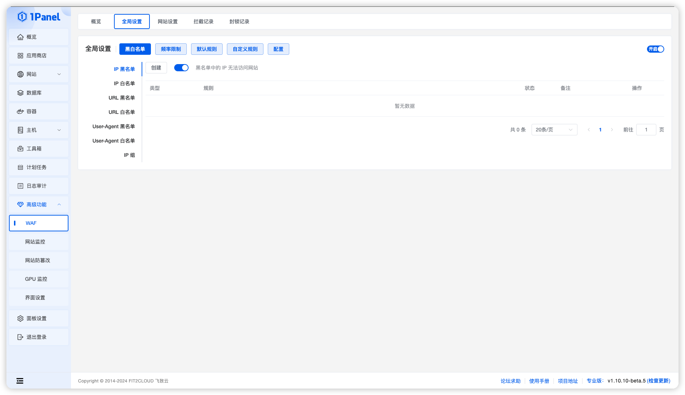
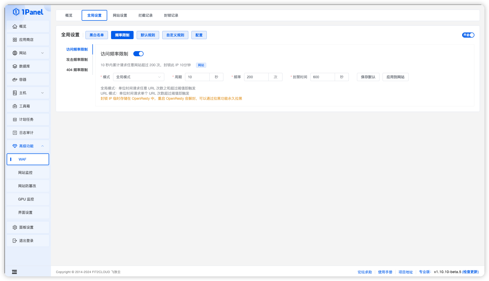
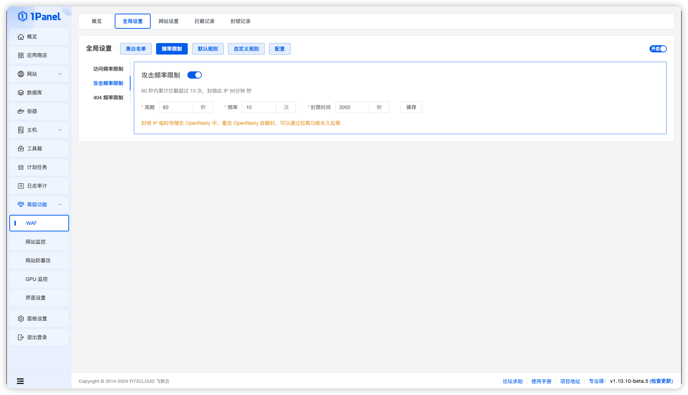
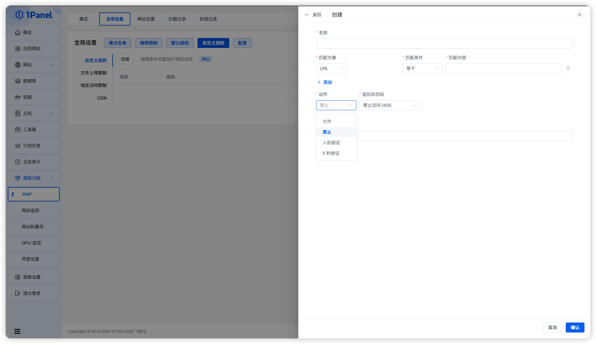
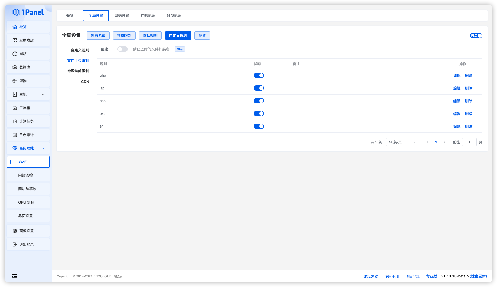
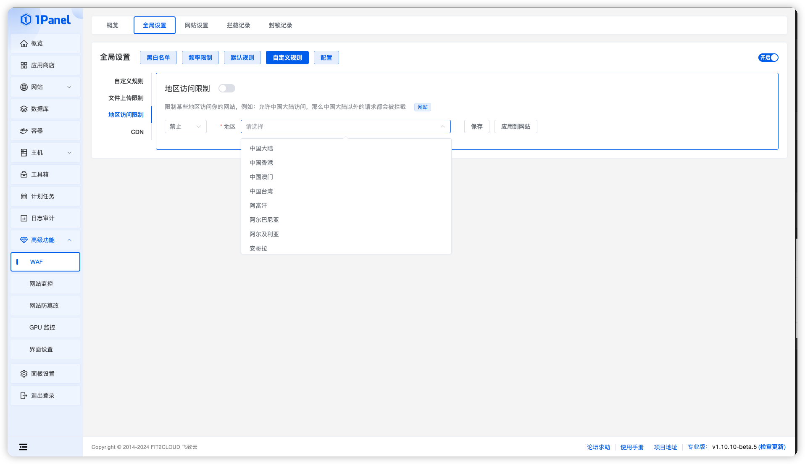
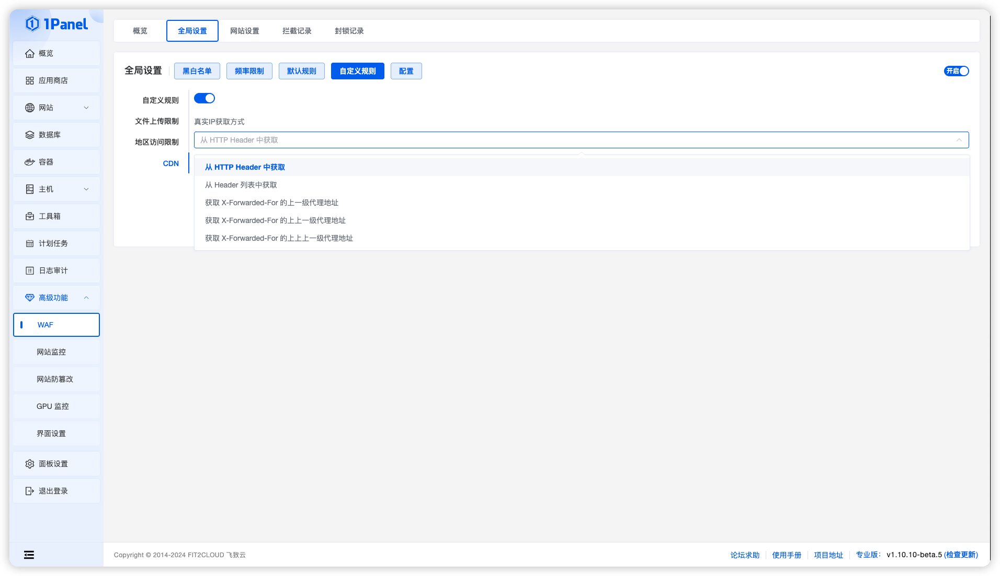
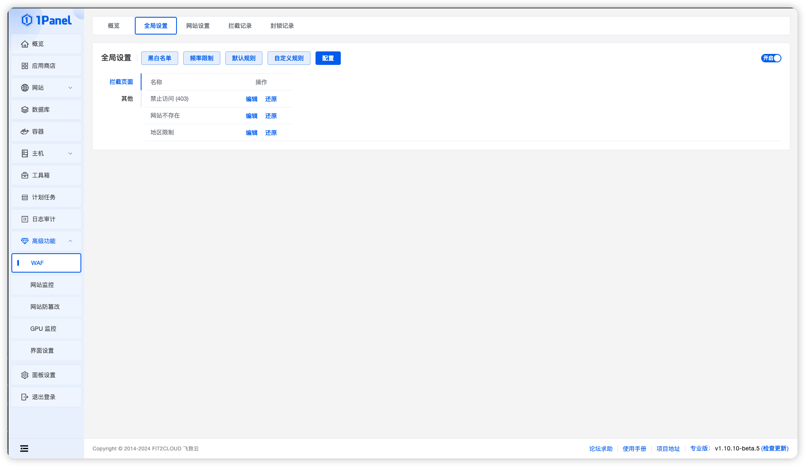

!!! Abstract ""

    全局设置 可以查看并配置 WAF。  
    包括黑白名单 频率设置 默认规则 自定义规则 配置等功能  
    注意：  
    1.全局设置的开关可以控制所有网站的规则，比如关闭访问频率之后所有网站的访问频率限制都会失效  
    2.全局设置中的小项，比如默认规则-参数规则的第一项，关闭了之后，只影响新建网站，不影响现存网站
    

{ width="900px" }

## 1 黑白名单

!!! Abstract ""

    包括 IP 黑白名单、 URL 黑白名单、User-Agent 黑白名单、IP 组  
    黑名单：阻止携带黑名单特征的请求  
    白名单：对携带白名单特征的请求，不做 WAF 校验

### 1.1 IP 黑白名单
    
!!! Abstract ""

    可以根据 IP 地址阻止/放行请求

### 1.2 URL 黑白名单

!!! Abstract ""
    
    黑名单：可以阻止用户访问某些 URL   
    白名单：用户访问白名单中的 URL 不会触发 WAF 校验，适合某些请求中包含 SQL 注入和 XSS 特征的请求，比如 WordPress Halo 文章保存接口

### 1.3 User-Agent 黑白名单

!!! Abstract ""

    可以根据 User-Agent 阻止/放行请求

### 1.4 IP 组
    
!!! Abstract ""
    
    可以把多个 IP 包含在一个组中，用于 IP 黑白名单

## 2 频率限制

!!! Abstract ""
    
    可以用来抵御 CC 攻击，包含访问频率限制、攻击频率限制、404 频率限制

### 2.1 访问频率限制

!!! Abstract ""

    如果单位时间内请求超过阈值，就拉黑 IP 一段时间  
    全局模式：单位时间请求任意 URL 次数之和超过阈值即触发  
    URL 模式：单位时间请求单个 URL 次数超过阈值即触发
    

{ width="900px" }

### 2.2 攻击频率限制

!!! Abstract ""

    如果某个 IP 一直触发 WAF 规则，则拉黑此 IP  
    场景：某个 IP 一直攻击你的网站，触发了多次规则

{ width="900px" }

### 2.3 404频率限制    

!!! Abstract ""
    
    如果某个 IP 的访问一直返回 404 ，则拉黑此 IP  
    场景：扫描器或者恶意爬虫一直爬你的网站

{ width="900px" }

## 3 默认规则

!!! Abstract ""

    WAF 的默认规则，按照一定的规则来阻止恶意请求

### 3.1 参数规则

!!! Abstract ""

    过滤常见的恶意参数

### 3.2 URL 规则

!!! Abstract ""

    过滤常见的恶意 URL

### 3.3 HTTP 规则

!!! Abstract ""

    设置允许访问的方法类型，如果想限制某些类型访问，请关闭这个类型的按钮，例如：仅允许 GET 类型访问，那么需要关闭除了 GET 之外的其他类型按钮

### 3.4 Cookie 规则

!!! Abstract ""

    过滤携带恶意 Cookie 的请求

### 3.5 Header 规则

!!! Abstract ""

    过滤携带恶意 Header 的请求

### 3.6 User-Agent 规则

!!! Abstract ""
    
    过滤携带恶意 User-Agent 的请求

### 3.7 其他

!!! Abstract ""

    SQL 注入防御 和 XSS 防御

## 4 自定义规则

!!! Abstract ""
    
    根据自己的需求制定 WAF 规则  
    包含自定义规则、文件上传限制、地区访问限制、CDN 配置

## 4.1 自定义规则

!!! Abstract ""

    根据自己的需求制定 WAF 规则  
    可以匹配 URL IP Header Host 的参数，并选择相应的动作  
    比如可以选择 URL 为 /login 的比如经过人机验证

{ width="900px" }

## 4.2 文件上传限制

!!! Abstract ""

    可以根据文件后缀限制上传文件的类型

{ width="900px" }

## 4.3 地区访问限制

!!! Abstract ""

    可以限制或者仅允许某些地区的访问

{ width="900px" }

## 4.4 CDN

!!! Abstract ""

    如果网站开启了 CDN 并且影响日志获取用户的 IP，可以开启此项  
    从 HTTP Header 中获取：从指定的请求 Header 中获取，需要确认 CDN 把真实 IP 放在哪个 Header，比如 CloudFlare 默认是放在 cf-connecting-ip 中  
    从 Header 列表中获取： 从常用的 CDN 携带真实 IP 的 HTTP Header 中获取，取第一个能获取到的值      
    获取 X-Forwarded-For 的上一级代理地址：例如：X-Forwarded-For: client,proxy1,proxy2,proxy3 上一级代理会取最后一个 IP proxy3

{ width="900px" }

## 5 配置

!!! Abstract ""

    包含拦截页面和恶意 IP 组

### 5.1 拦截页面

!!! Abstract ""

    可以自定义拦截页面

{ width="900px" }

### 5.2 恶意 IP 组

!!! Abstract ""

    拦截由 1Panel 提供的恶意 IP 组
