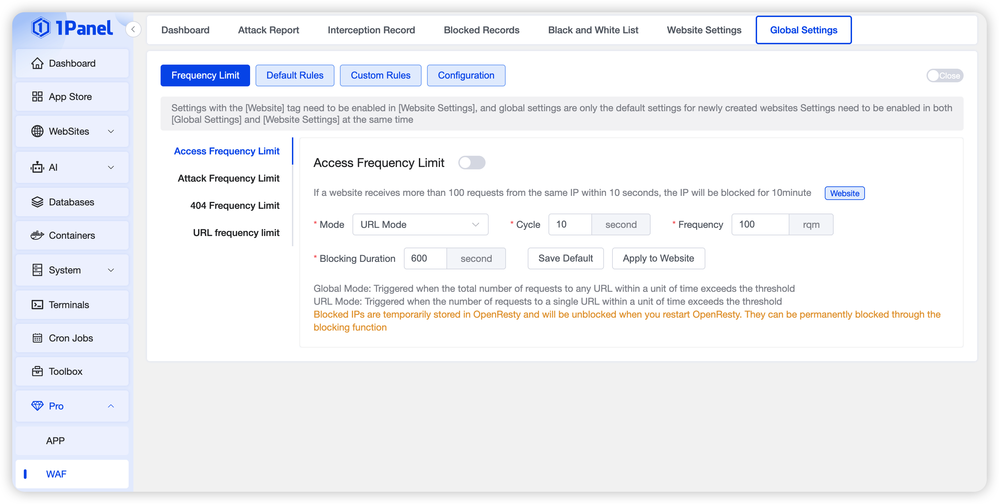
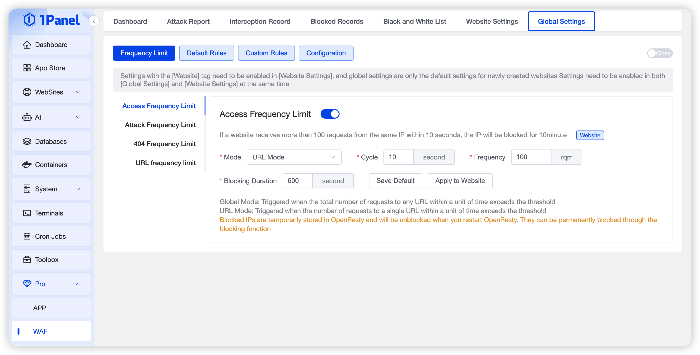
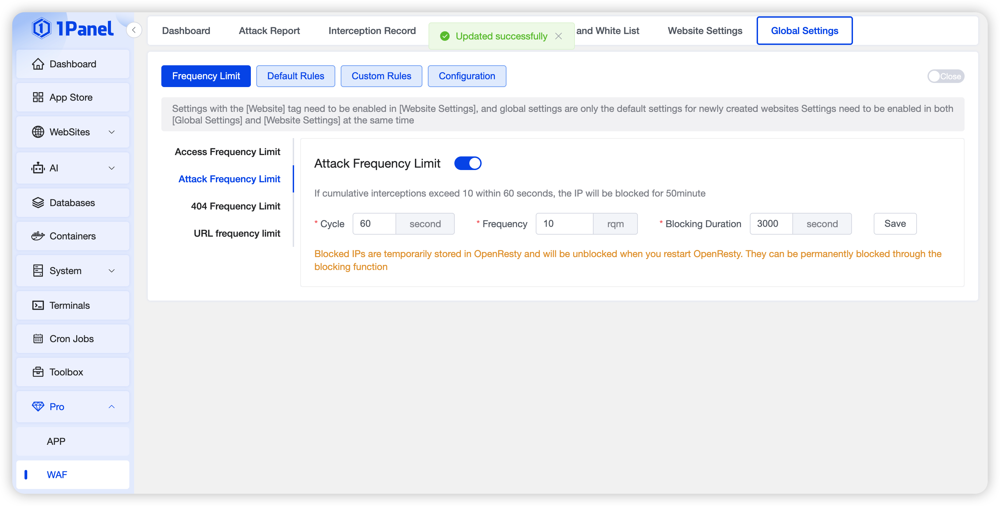
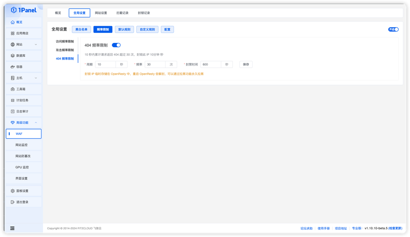
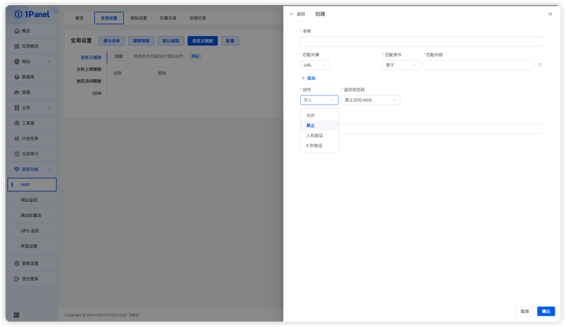
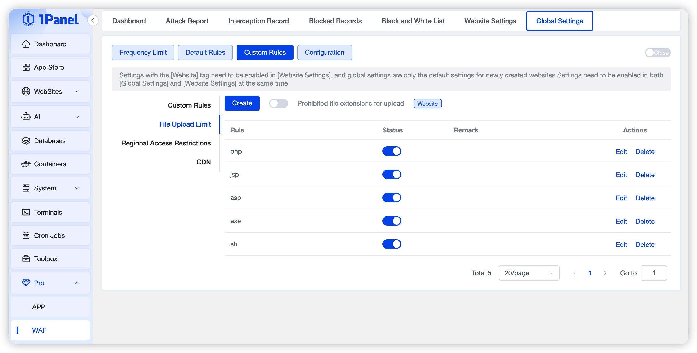
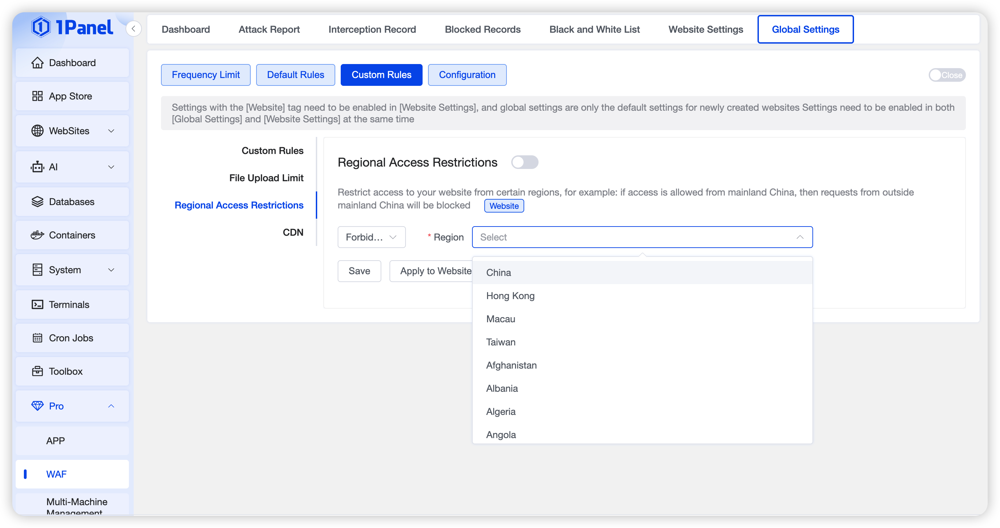
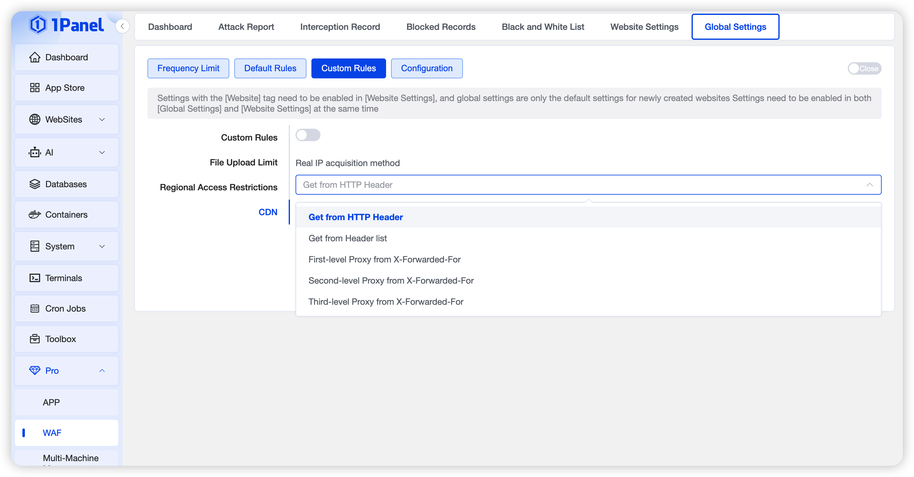
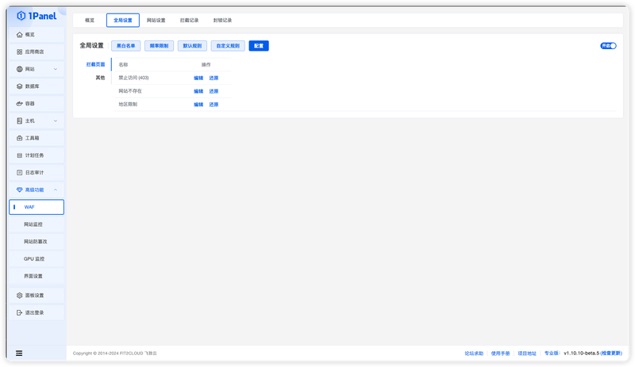

!!! note ""
    On the **Global Settings** page, you can view and configure WAF.
    It includes allowlists & blocklists, rate limits, default rules, custom rules, and advanced configurations.

    Notes:
    - The master switch in Global Settings controls rules for **all websites**. For example, disabling Access Rate Limit will disable it for every site.
    - Individual items in Global Settings (such as the first rule in Default Rules → Parameter Rules) only affect **newly created websites** after being disabled; existing websites are not affected.

{ width="900px" }
{: .original}

## 1 Allowlist & Blocklist

!!! note ""
    - Includes IP Allowlist/Blocklist, URL Allowlist/Blocklist, User-Agent Allowlist/Blocklist, and IP Groups.
    - **Blocklist**: Blocks requests matching blocklist entries.
    - **Allowlist**: Skips WAF checks for requests matching allowlist entries.

### 1.1 IP Allowlist & Blocklist
!!! note ""
    Allow or block requests based on IP address.

### 1.2 URL Allowlist & Blocklist
!!! note ""
    - **Blocklist**: Blocks access to specified URLs.
    - **Allowlist**: Bypasses WAF checks for whitelisted URLs, useful for APIs that may contain SQL/XSS patterns (e.g., WordPress / Halo post save endpoints).

### 1.3 User-Agent Allowlist & Blocklist
!!! note ""
    Allow or block requests based on User-Agent.

### 1.4 IP Group
!!! note ""
    Group multiple IP addresses for use in IP allowlists or blocklists.

## 2 Rate Limit
!!! note ""
    Defends against CC attacks, including Access Rate Limit, Attack Rate Limit, and 404 Rate Limit.

### 2.1 Access Rate Limit
!!! note ""
    - Temporarily blocks an IP if requests exceed the threshold within a time window.
    - **Global Mode**: Triggers if total requests to any URL exceed the threshold.
    - **URL Mode**: Triggers if requests to a single URL exceed the threshold.

{ width="900px" }
{: .original}

### 2.2 Attack Rate Limit
!!! note ""
    - Blocks an IP if it repeatedly triggers WAF rules.
    - Use case: An IP attacking your site and violating multiple rules.

{ width="900px" }
{: .original}

### 2.3 404 Rate Limit
!!! note ""
    - Blocks an IP if it generates too many 404 responses.
    - Use case: Scanners or malicious crawlers probing your site.

{ width="900px" }
{: .original}

## 3 Default Rules
!!! note ""
    Built‑in WAF rules that block common malicious requests.

### 3.1 Parameter Rules
!!! note ""
    Filters malicious query parameters.

### 3.2 URL Rules
!!! note ""
    Filters malicious URLs.

### 3.3 HTTP Rules
!!! note ""
    Sets allowed HTTP methods. Disable methods you want to block (e.g., only allow GET).

### 3.4 Cookie Rules
!!! note ""
    Filters requests with malicious cookies.

### 3.5 Header Rules
!!! note ""
    Filters requests with malicious headers.

### 3.6 User-Agent Rules
!!! note ""
    Filters requests with malicious User-Agents.

### 3.7 Others
!!! note ""
    SQL Injection Protection and XSS Protection.

## 4 Custom Rules
!!! note ""
    - Define your own WAF rules.
    - Includes custom ACL rules, file upload restrictions, region access control, and CDN settings.

### 4.1 Custom Rules (✨ Pro Edition)
!!! note ""
    - Create custom WAF rules based on your needs.
    - Match conditions including URL, IP, Header, Host, and perform actions.
    - Example: Require CAPTCHA for requests to `/login`.

{ width="900px" }
{: .original}

### 4.2 File Upload Restriction
!!! note ""
    Restrict allowed file types by extension.

{ width="900px" }
{: .original}

### 4.3 Region Access Control (✨ Pro Edition)
!!! note ""
    Block or allow access from specific regions.

{ width="900px" }
{: .original}

### 4.4 CDN
!!! note ""
    Enable if your site uses CDN and real client IPs are not logged correctly:
    - **From HTTP Header**: Extract from a specified header (e.g., `cf-connecting-ip` for Cloudflare).
    - **From Header List**: Auto‑detect from common real‑IP headers.
    - **From X-Forwarded-For**: Use the last proxy IP (e.g., `X-Forwarded-For: client,proxy1,proxy2,proxy3` → use `proxy3`).

{ width="900px" }
{: .original}

## 5 Configuration
!!! note ""
    Includes block page settings and malicious IP groups.

### 5.1 Block Page (✨ Pro Edition)
!!! note ""
    Customize the WAF block page.

{ width="900px" }
{: .original}

### 5.2 Malicious IP Group
!!! note ""
    Block malicious IP groups provided by 1Panel.
