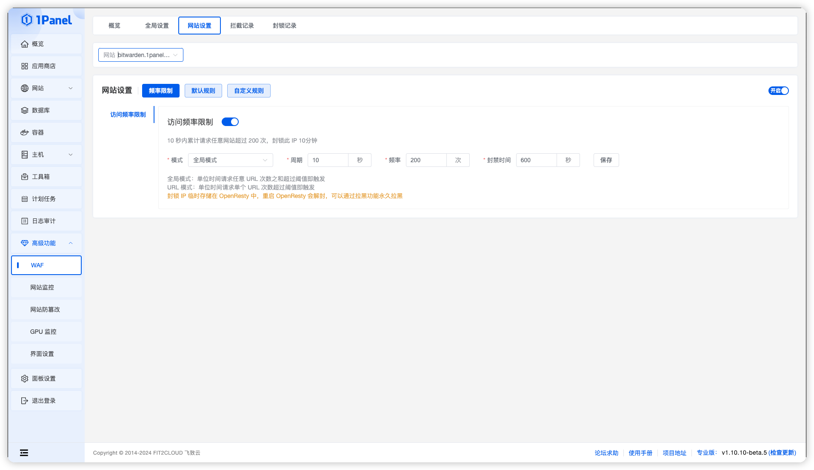

!!! Abstract ""

    网站设置，可以查看并配置某个网站的 WAF 规则。  
    包括频率设置 默认规则 自定义规则 等

{ width="900px" }

## 1 频率限制

!!! Abstract ""

    可以用来抵御 CC 攻击，包含访问频率限制、攻击频率限制、404 频率限制

### 1.1 访问频率限制

!!! Abstract ""

    如果单位时间内请求超过阈值，就拉黑 IP 一段时间  
    全局模式：单位时间请求任意 URL 次数之和超过阈值即触发  
    URL 模式：单位时间请求单个 URL 次数超过阈值即触发

{ width="900px" }

## 2 默认规则

!!! Abstract ""

    WAF 的默认规则，按照一定的规则来阻止恶意请求

### 2.1 参数规则

!!! Abstract ""

    过滤常见的恶意参数

### 2.2 URL 规则

!!! Abstract ""

    过滤常见的恶意 URL

### 2.3 HTTP 规则

!!! Abstract ""

    设置允许访问的方法类型，如果想限制某些类型访问，请关闭这个类型的按钮，例如：仅允许 GET 类型访问，那么需要关闭除了 GET 之外的其他类型按钮

### 2.4 Cookie 规则

!!! Abstract ""

    过滤携带恶意 Cookie 的请求

### 2.5 Header 规则

!!! Abstract ""

    过滤携带恶意 Header 的请求

### 2.6 User-Agent 规则

!!! Abstract ""

    过滤携带恶意 User-Agent 的请求

### 2.7 其他

!!! Abstract ""

    SQL 注入防御 和 XSS 防御

## 3 自定义规则

!!! Abstract ""

    根据自己的需求制定 WAF 规则  
    包含自定义规则、文件上传限制、地区访问限制、CDN 配置

## 3.1 自定义规则

!!! Abstract ""

    根据自己的需求制定 WAF 规则  
    可以匹配 URL IP Header Host 的参数，并选择相应的动作  
    比如可以选择 URL 为 /login 的比如经过人机验证

{ width="900px" }

## 3.2 文件上传限制

!!! Abstract ""

    可以根据文件后缀限制上传文件的类型

{ width="900px" }

## 3.3 地区访问限制

!!! Abstract ""

    可以限制或者仅允许某些地区的访问

{ width="900px" }

## 3.4 CDN

!!! Abstract ""

    如果网站开启了 CDN 并且影响日志获取用户的 IP，可以开启此项  
    从 HTTP Header 中获取：从指定的请求 Header 中获取，需要确认 CDN 把真实 IP 放在哪个 Header，比如 CloudFlare 默认是放在 cf-connecting-ip 中  
    从 Header 列表中获取： 从常用的 CDN 携带真实 IP 的 HTTP Header 中获取，取第一个能获取到的值      
    获取 X-Forwarded-For 的上一级代理地址：例如：X-Forwarded-For: client,proxy1,proxy2,proxy3 上一级代理会取最后一个 IP proxy3

{ width="900px" }

