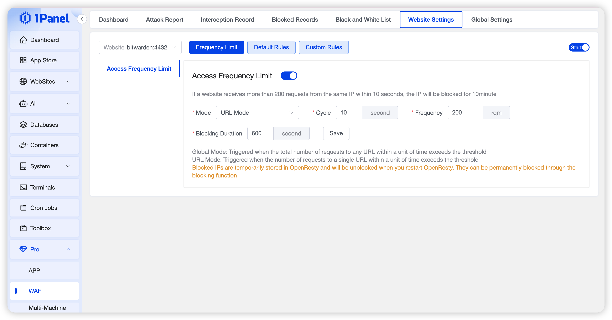

!!! note ""
    On the **Website Settings** page, you can view and configure WAF rules for a specific website.
    This includes rate limits, default rules, custom rules, and more.

{ width="900px" }
{: .browser-mockup}

## 1 Rate Limit

!!! note ""
    Defends against CC attacks, including Access Rate Limit, Attack Rate Limit, and 404 Rate Limit.

### 1.1 Access Rate Limit

!!! note ""
    Temporarily blocks an IP if requests exceed the threshold within a time window.

    - **Global Mode**: Triggers if total requests to any URL exceed the threshold.
    - **URL Mode**: Triggers if requests to a single URL exceed the threshold.

{ width="900px" }
{: .browser-mockup}

## 2 Default Rules

!!! note ""
    Built-in WAF rules that block common malicious requests.

### 2.1 Parameter Rules
!!! note ""
    Filters malicious query parameters.

### 2.2 URL Rules
!!! note ""
    Filters malicious URLs.

### 2.3 HTTP Rules
!!! note ""
    Sets allowed HTTP methods. Disable methods you want to block.
    Example: To allow only GET, disable all other methods.

### 2.4 Cookie Rules
!!! note ""
    Filters requests with malicious cookies.

### 2.5 Header Rules
!!! note ""
    Filters requests with malicious headers.

### 2.6 User-Agent Rules
!!! note ""
    Filters requests with malicious User-Agents.

### 2.7 Others
!!! note ""
    SQL Injection Protection and XSS Protection.

## 3 Custom Rules

!!! note ""
    Define your own WAF rules according to your needs.

    - Includes custom ACL rules, file upload restrictions, region access control, and CDN settings.

### 3.1 Custom Rules (✨ Pro Edition)
!!! note ""
    Create custom WAF rules. Match conditions including URL, IP, Header, Host, and perform actions.
    Example: Require CAPTCHA for requests to `/login`.

{ width="900px" }
{: .browser-mockup}

### 3.2 File Upload Restriction
!!! note ""
    Restrict allowed file types by extension.

{ width="900px" }
{: .browser-mockup}

### 3.3 Region Access Control (✨ Pro Edition)
!!! note ""
    Block or allow access from specific regions.

{ width="900px" }
{: .browser-mockup}

### 3.4 CDN
!!! note ""
    Enable if your site uses CDN and real client IPs are not logged correctly:

    - **From HTTP Header**: Extract from a specified header (e.g., `cf-connecting-ip` for Cloudflare).
    - **From Header List**: Auto-detect from common real-IP headers.
    - **From X-Forwarded-For**: Use the last proxy IP.
      Example: `X-Forwarded-For: client,proxy1,proxy2,proxy3` → use `proxy3`.

{ width="900px" }
{: .browser-mockup}
